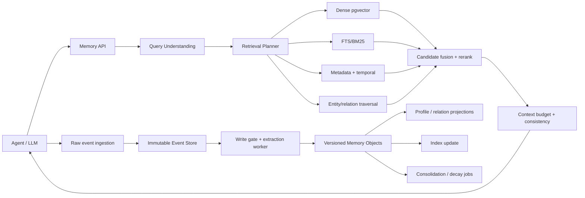
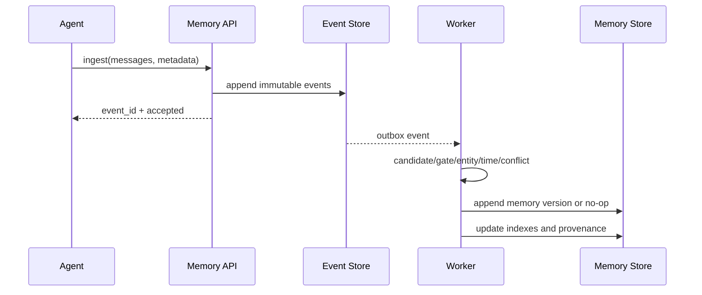

# 03 Architecture

## 推荐架构

采用事件溯源的单体服务起步：PostgreSQL 作为 source of truth，`pgvector` 保存 embedding，PostgreSQL FTS/BM25 负责稀疏检索，关系表表达实体和时态关系；抽取、整理、索引更新通过任务队列异步执行。所有派生表带 `model_version`、`extractor_version` 和 provenance，可从事件重建。

## 写入和读取边界

同步热路径只做事件持久化、必要的高优先级候选和轻量检索；抽取、实体解析、冲突检测、embedding、profile projection 默认异步。用户刚刚明确的事实可通过 `urgency=immediate` 触发受限同步确认，但仍写入事件后再生成 projection。

## 作用域和权限

namespace = `(tenant_id, user_id, agent_id, project_id, scope)`；默认最小可见范围为 user+agent。共享记忆必须显式 grant。LLM 可以读取被授权对象、提交候选和调用有限工具；不能删除源事件、跨用户读取、修改历史版本或绕过敏感字段策略。

## 扩展路径

100K events 以内优先单 PostgreSQL；到 1M events 先分区、索引和异步 workers，再评估 OpenSearch/Qdrant。只有图遍历 p95 或写入并发成为瓶颈，才引入 Neo4j/Graphiti/FalkorDB；图数据库不是功能目标本身。
