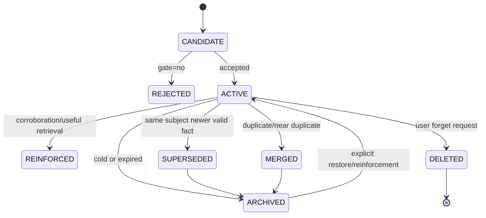

# 04 Memory Lifecycle

## 状态机

## 写入流程

1. 追加 `Message/Event`，分配 idempotency key；原始 payload immutable。
2. 抽取候选：实体、属性、关系、事件、时间表达、证据状态、敏感标签。
3. Write Gate 打分：explicit request、future utility、novelty、repetition、confidence、duration expectation、sensitivity。低于阈值或仅为闲聊则拒绝。
4. Entity resolution 只在同一 namespace 内做；不确定时创建 unresolved entity，不强行合并。
5. duplicate detection 用 canonical key + FTS/embedding + 时间/实体约束；重复只增加 evidence，不复制对象。
6. contradiction detection 以 subject/predicate/object/validity 为键；新事实使旧事实 `valid_to` 关闭或进入冲突集，不删除历史。
7. 写入新 memory version，建立 `derived_from`、`supersedes`、`contradicts`，更新 projection 和索引。

## 更新与合并

“用户现在主要用 Python”只有在 predicate 相同或规则明确时才 supersede “主要使用 Java”；否则两个事实并存。merge 只用于同一事实的重复表达，必须保留所有 source event。profile 是可重建的当前视图，不是事实历史。

## 强化、衰减和归档

强化来自独立来源重复确认、用户纠正后的确认、成功检索使用；访问次数单独记录，不能伪造事实置信度。召回分数可用：

`score = w_r*relevance + w_i*importance + w_c*confidence + w_n*novelty + w_t*temporal_fit - w_d*decay`。

Decay 只降低候选优先级或移动到冷层。稳定身份、明确长期偏好和用户指定保留项没有自动 TTL；临时计划按时间窗口过期；敏感对象按 retention policy 处理。归档仍可按历史查询恢复。

## Consolidation

session 结束后做轻量 consolidation；空闲或每日做重型 consolidation。流程是 cluster → summarize → identify repeated observations → propose semantic/profile update → duplicate/conflict review → append versions。每次作业记录输入事件范围、模型版本、输出变更和 dry-run 结果。

## 删除与纠正

用户删除 memory 时写 tombstone 并从 active retrieval 隐藏；删除 source event 时，依赖图追踪 derived memories，撤销或降级只依赖该事件的对象，多来源对象保留并降低置信度。可恢复删除和不可恢复硬删除分开；硬删除必须清理 event payload、memory versions、vectors、FTS、graph edges、cache 和导出副本，并记录最小合规审计信息。
