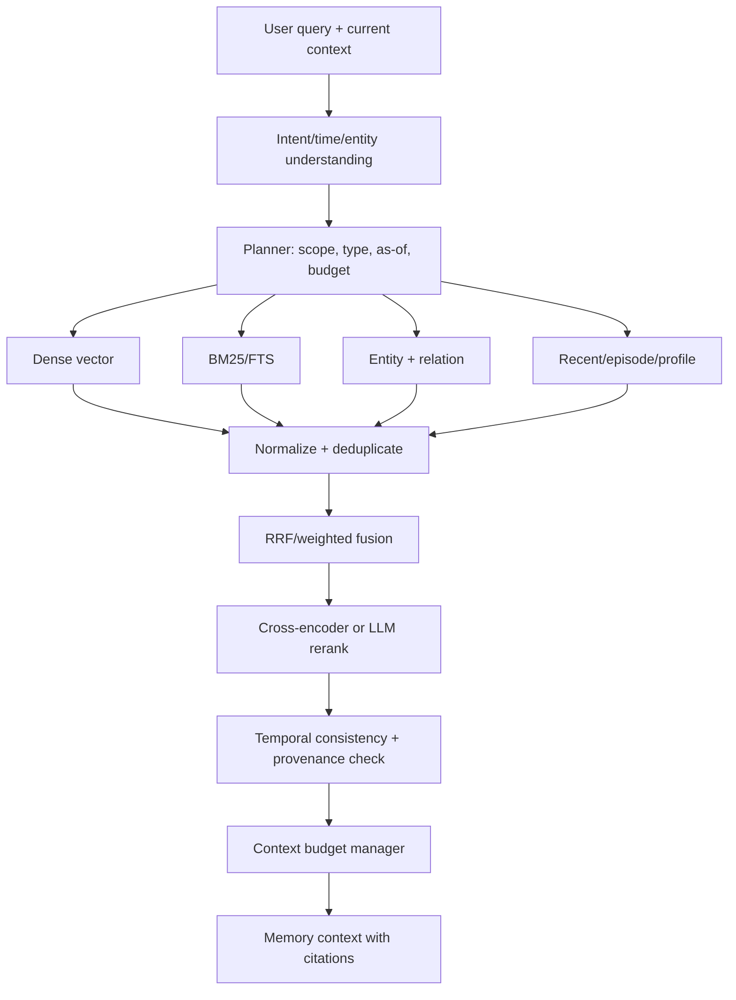

# 06 Retrieval Design

## Pipeline

## Query planning

解析 intent：current fact、historical as-of、timeline、preference、episode、procedure、multi-hop、abstention。解析显式和隐式时间表达，默认 current 不能把历史事实排除在可解释结果之外。planner 决定 scope、memory kind、validity filter、top-k、token budget 和是否需要多跳。

## 候选融合

MVP 采用 RRF，后续用离线标注学习权重。每条候选保留来源、版本、时间匹配、召回通道和原始分数。先做 hard filters（权限、namespace、删除状态、时间窗口），再做 soft ranking；不要让 embedding 相似度绕过权限或时间约束。

## 重排与多跳

候选规模小于 100 时可用 cross-encoder；高延迟场景用轻量模型，LLM reranker 仅用于实验。多跳先取实体邻居和相关 episodes，再做二次查询；每跳都有最大深度、预算和 provenance，避免图扩散污染上下文。

## Context builder

按 relevance、temporal_fit、importance、confidence、diversity、token_cost 做 knapsack/贪心选择。优先当前事实和直接证据，再加入必要的历史对照；相互冲突候选必须一起呈现为带日期的版本或明确过滤。每个片段以 `[memory_id; observed_at; valid_from/to; source]` 标注，支持回答引用和 abstention。

## 失败安全

没有足够证据时返回空或“未知”，不能以相似但不同实体填空。检索服务超时则只返回 working memory，并让上层知道 `degraded=true`；禁止静默使用全量历史。记录 recall@k、answer support rate、abstention precision、p50/p95/p99。
