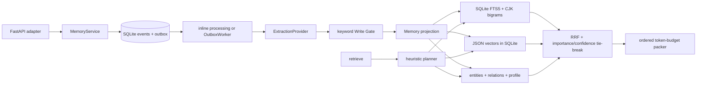

# Phase 3 Architecture Review

审计日期：2026-09-20  
审计基线：commit `16f2134`，审计开始时工作树 clean  
结论标签：**架构方向正确的 SQLite 本地 MVP；尚不是 production Agent Memory System**

## 0. Executive verdict

当前仓库最有价值的部分不是检索通道数量，而是已经建立了一个可演进的正确骨架：immutable event 作为证据源、outbox 驱动 projection、memory/provenance/version/tombstone 分离、namespace 先过滤、可离线回放、SQLite 确定性测试路径。这些部分应保留。

但 Phase 3 的三个核心问题尚未真正解决：

1. **Formation** 仍由少量正则和关键词 gate 决定，真实 LLM extractor 没有严格 schema，也没有可信的失败语义或足够测试。
2. **Evolution** 只有“少数单值谓词值变化即 supersede”和手工 duplicate consolidation；没有 relationship classifier、contradiction/refinement/temporal-update 语义，也没有完整的状态变更审计。
3. **Retrieval** 在默认配置下不是语义检索。deterministic hash vector 被禁止单独支撑答案，实际质量主要来自 FTS/CJK bigram、四个硬编码 predicate 和简单 entity/relation 信号。当前 multi-hop 由于所有边共享 `user:<namespace>` 中心点，第二跳会扩散到该用户几乎所有结构化事实，不足以证明 graph retrieval 有效。

最重要的判断是：**下一步不能先加 reranker、图数据库或更多 memory type；必须先建立能分层测量 formation、evolution、retrieval 和 QA 的 benchmark/gold suite。** 没有这一层，任何“升级”都无法区分真实收益、fixture 过拟合和复杂度装饰。

## 0.1 Audit method and reproducible evidence

本轮完整检查了 `README.md`、`docs/`、全部 ADR、`src/dive_memory/`、`tests/`、三份 PostgreSQL migration、`pyproject.toml`、CLI、FastAPI adapter、benchmark/evaluation 代码，以及 TODO/FIXME/placeholder 搜索结果。

执行证据：

| Check | Result | Interpretation |
|---|---:|---|
| `pytest -q --basetemp .pytest-phase3-audit` | 95 passed / 1.77 s | 当前 deterministic suite 全绿 |
| Python stdlib `trace` statement coverage | 89.4%（1931 executed / 229 missed） | 近似语句覆盖；项目没有配置 `coverage.py`，不是 branch coverage |
| `dive_memory.llm` trace coverage | 36.4% | 真实 extraction provider 是最明显测试盲区 |
| `python -m dive_memory.smoke` | 3 cases；recall 1.0；abstention 1.0 | 只证明小型自洽 fixture，不代表泛化能力 |
| SQLite 10K / 20 query rerun | retrieve p50 357.4 ms；p95 365.2 ms；p99 369.9 ms | 全表 Python cosine 路径已呈现线性扫描成本 |
| TODO/FIXME search | 无实质 TODO/FIXME | 缺口主要是设计能力和验证，不是注释列表 |
| PostgreSQL tests | 仅 SQL 文本断言 | 没有启动 PostgreSQL/pgvector，也没有执行 migration |

本次 10K 结果来自 Windows、Python 3.14、本机 SQLite in-memory 运行；硬件信息未能读取，且没有 warm-up、RSS、数据库大小或置信区间，因此只能作为本地审计快照，不能与别的机器或生产目标直接比较。

---

## 1. Current architecture

### 1.1 Runtime path that actually exists

`MemoryService` is the orchestration boundary, but it constructs `SQLiteStore` directly; there is no repository/store protocol and no PostgreSQL runtime adapter. `EmbeddingProvider` and `ExtractionProvider` are genuine dependency-inversion seams. FastAPI is optional and domain code remains importable without it.

### 1.2 Write path

1. `ingest()` validates timestamps and atomically appends an `Event` plus outbox row.
2. Ordinary HTTP events default to deferred processing; explicit remember requests can process inline.
3. `_process_event()` invokes an extractor, persists a write decision, constructs a deterministic memory id, applies a limited conflict rule, and writes memory/vector/FTS/provenance/entity/relation/profile projections.
4. Projection and outbox completion share a SQLite transaction. Failure leaves the event retryable.
5. Replay clears derived state and reprocesses non-tombstoned events in parsed UTC order.

This is a sound local event-driven projection pattern. It is not full CQRS and does not need to become full CQRS at the current scale.

### 1.3 Read path

`plan_query()` uses keyword rules to infer temporal intent and four predicates. `SQLiteStore.search()` then:

- hard-filters namespace and status in SQL;
- computes FTS5 matches;
- loads every eligible vector and computes cosine in Python;
- derives entity, relation, optional two-hop and predicate membership;
- applies valid-time and observation-time filters in Python;
- converts each signal to a rank and applies RRF with fixed `k=60`;
- multiplies the fused score by a narrow importance/confidence factor;
- records access rows;
- greedily packs results in retrieval order with `len(text) // 4` token estimation.

The result exposes actual contributing channels, provenance, plan metadata and abstention when no supported candidate remains. It does not expose exclusion reasons, per-channel candidate counts or latency.

### 1.4 Persistence model

SQLite is the only executable backend. PostgreSQL is represented by reference DDL and three outbox helper functions. The local schema contains events, outbox, memories, versions, decisions, sources, vectors, FTS, tombstones, access, entities, relations, profiles, modes and jobs.

The namespace is a single opaque string. The richer `(tenant, user, agent, project, scope)` model in `docs/03-architecture.md` does not exist as independently enforceable columns.

---

## 2. Current capabilities

### 2.1 Capability truth table

| Capability | Status | What is real | Boundary / qualification |
|---|---|---|---|
| Event sourcing pattern | Implemented locally | append event, derived projections, replay | DB does not enforce event immutability; replay behavior depends on current extractor code |
| Atomic outbox | Implemented in SQLite | append event+outbox; projection+DONE transaction | PostgreSQL functions are unexecuted reference SQL |
| Idempotency | Implemented | key scoped by namespace; legacy schema upgrade | no distributed API/worker integration test |
| Provenance | Implemented | `memory_sources`, source refs in retrieval/export | provenance confidence/role is not modeled |
| Version/supersession chain | Partial | deterministic ids, `supersedes_id`, chain API | lifecycle mutations do not append version snapshots |
| Bi-temporal-aware querying | Partial but useful | valid interval + observed cutoff; timezone-normalized comparisons | not a DB-native bitemporal schema; vague/relative language is mostly unsupported |
| Soft delete / hard purge | Implemented locally | vector/FTS/relation/entity/access/source/version cleanup tests | no PostgreSQL/cache/object-store integration; soft delete retains raw event content by design |
| Memory mode | Implemented | persistent per-namespace enable/disable | policy has only one boolean |
| Heuristic extraction | Implemented | five Chinese structured patterns plus coarse type hints | one candidate/event; narrow Chinese/English coverage |
| LLM extraction adapter | Interface + MVP adapter | OpenAI-compatible HTTP call and fallback | no strict schema; model fields mostly discarded; low test coverage |
| Write gate | Implemented fallback | explicit/keyword/ephemeral/secret rules; decision persisted | not utility scoring; no novelty/redundancy/calibration |
| Duplicate consolidation | Manual MVP | exact predicate/value merge with provenance union | not online; no semantic duplicate/refinement classification |
| Reinforcement/decay | Mechanical MVP | mutable importance/confidence and TTL archive | no evidence-aware policy; changes absent from version history |
| BM25/lexical | Implemented locally | FTS5 `bm25()` ordering plus CJK bigrams | PostgreSQL `simple` FTS does not reproduce CJK behavior |
| Dense retrieval | Provider seam exists | real providers can be injected | default is hash; SQLite scans all vectors; no ANN |
| Entity/relation retrieval | Basic implementation | namespace-scoped entity/relation tables and signals | entity linking is string normalization; relation ontology has four predicates |
| Multi-hop | Experimental only | bounded depth/edge count | star-shaped user graph causes broad two-hop expansion |
| RRF | Implemented | rank-only fusion across available signals | fixed constant; channel pools not independently bounded; no ablation evidence |
| Reranking | Heuristic only | importance/confidence multiplier | no cross-encoder/LLM reranker |
| Context packing | Basic | budget, provenance and validity labels | no dedup/diversity/contradiction control; Chinese token estimate is inaccurate |
| Evaluation | Smoke harness | hit/abstain/false-memory/provenance/latency | no Precision@K, MRR, nDCG, formation/evolution/QA layers |
| Baselines A–E | Names/functions exist | callable local functions | not scientifically comparable; same budget/reader/judge is not enforced |
| 10K load check | Reproducible locally | labeled SQLite p50/p95/p99 | only 20 queries and two trivial quality cases |
| PostgreSQL + pgvector | Design/reference DDL | schema and `SKIP LOCKED` SQL text | no adapter, index, live migration or integration test |
| API authorization | Optional boundary | bearer token to namespace allow-list | disabled by default; no RLS; action argument is ignored by static authorizer |

### 2.2 What the test suite does well

The suite has unusually good local regression coverage for an MVP. It pins transaction rollback, idempotency, two-connection outbox claiming, stale claims, deterministic replay, mixed timezone ordering, temporal boundaries, soft/hard deletion residue, namespace leakage, CJK retrieval, natural predicate queries, strict API schemas, provider failure, vector reindexing and terminal lifecycle states.

The suite is deterministic and fully offline. This property must not be sacrificed when adding real models.

### 2.3 What test count and coverage do not prove

- No real LLM extraction response is validated end-to-end.
- No public benchmark fixture is present.
- No ranking metric is calculated.
- No PostgreSQL statement is executed.
- No process-level or multi-instance concurrency is exercised.
- No IAM, encryption, KMS, backup/restore or row-level security exists.
- No 100K/1M dataset has been measured.
- Statement coverage is not branch or mutation coverage and the project has no CI coverage gate.

---

## 3. MVP implementations

The following are deliberately MVP-grade and should be labeled that way in README/ADR/benchmark output.

### 3.1 Deterministic embedding

`DeterministicEmbeddingProvider` hashes whitespace tokens into 96 dimensions. It is valuable for unit tests and regression stability, not semantic similarity. The search path correctly suppresses deterministic **dense-only** hits, but `vector_rag()` still presents this provider as a vector baseline. Until a semantic provider is configured, the product should be described as lexical/structured retrieval with a deterministic vector test projection—not hybrid semantic retrieval.

There is also a degraded-mode hazard: `OpenAICompatibleEmbeddingProvider` may return a deterministic fallback while its provider-level `semantic_similarity` remains `True`. If dimensions happen to match, a fallback hash vector can be treated as semantic. Production behavior needs an explicit result envelope such as `{vector, provider, model, degraded}` rather than a bare list.

### 3.2 Extraction and gate

The heuristic extractor recognizes residence, primary tool, preference and goal phrases, then falls back to a free-form statement. It emits at most one candidate. The gate assigns fixed values from explicit/keyword markers and rejects a narrow secret regex.

The OpenAI-compatible extractor asks for JSON in prose, not through a response schema. It catches provider/parsing errors and silently falls back to heuristics. It validates only a few enums; it does not validate value shape, time intervals, confidence bounds, entities or relations. Although the prompt requests `importance`, `confidence` and `durability`, returned values are discarded and recomputed by the keyword gate.

For a non-explicit event, an LLM may correctly normalize “I recently relocated to Shanghai” to “user lives in Shanghai”; the downstream keyword gate can then reject it because the normalized English content no longer contains the small durable-signal vocabulary. This path has no dedicated test.

### 3.3 Conflict and consolidation

The online resolver handles exactly one case: a different value for one of `residence`, `primary_tool`, or `goal` supersedes the active memory of the same kind/predicate. Same-value observations become duplicate active memories until an explicit consolidation job exact-matches predicate/value.

There is no explicit unrelated/duplicate/reinforcement/refinement/correction/temporal-update/contradiction/supersession classifier. `contradicts_id` exists but is never assigned. A user correction forces supersession but closes the previous valid interval at **observation time**, not necessarily the candidate's `occurred_from`/valid time; retrospective corrections can therefore produce the wrong history.

### 3.4 Versioning

Creation and supersession snapshots are inserted into `memory_versions`, and the service reconstructs a chain across memory ids. However:

- closing validity and changing the old status do not append/update an audit snapshot;
- reinforcement, decay, archive, merge and deletion mutate the current row without a corresponding version event;
- the original snapshot can still say `ACTIVE` with no `valid_to` after the row has become `SUPERSEDED`;
- replay uses the currently configured extractor, not the exact historical model/prompt/schema artifact.

The current code therefore provides a useful **supersession chain**, not a complete immutable version history of every memory state transition.

### 3.5 Retrieval graph

Every modeled fact creates `user:<namespace> -> predicate -> object`. Starting at `成都`, hop 1 reaches the shared user node; hop 2 reaches the user's other objects such as `绿茶`. The existing regression test explicitly expects this. It proves bounded traversal mechanics, but not semantically useful multi-hop reasoning. Until a benchmark shows benefit, this channel should be disabled by default or labeled experimental.

### 3.6 Evaluation baselines

The five baseline functions are API sketches:

- full history returns all event text without an answer stage or shared token budget;
- vector RAG can use the deterministic hash provider;
- summary-vector truncates the last 2,000 characters and does no vector retrieval;
- structured memory splits on whitespace, which is not a meaningful Chinese tokenizer;
- hybrid calls the system under test.

They are not yet controlled baselines suitable for an ablation table.

---

## 4. Production gaps

### P0 gaps: quality cannot yet be established

1. No gold formation/evolution/retrieval dataset and no public benchmark adapter.
2. No real default semantic embedding provider or measured model comparison.
3. No strict candidate schema and validation boundary for LLM output.
4. No utility gate with logged features and calibrated threshold.
5. No relationship-resolution engine or systematic relationship test matrix.
6. No channel switches, candidate traces or A–H ablation runner.

### P1 gaps: runtime is not production-backed

1. No storage protocol/PostgreSQL repository implementation.
2. No live migration tool/version table; SQL files are reference DDL.
3. No pgvector HNSW/IVFFlat index DDL or exact-vs-ANN benchmark.
4. `memory_vectors.embedding` is unbounded `vector`; production indexes require a fixed dimension or model-specific expression/partial index.
5. PostgreSQL FTS uses `simple`, which does not reproduce SQLite CJK bigram behavior.
6. No connection pool, retry policy, statement timeout, health/readiness distinction or shutdown lifecycle.
7. No structured logs, tracing, metrics exporter or request id.

### P1 gaps: model lifecycle

- Memory `model_version` currently stores the embedding model, while extractor version is only the provider class name.
- No prompt version, schema version, provider revision, normalization version or model checksum is persisted.
- Reindex is full-stop and synchronous; there is no dual-index/backfill/cutover strategy.
- Extraction replay can change history when a new model/provider is selected.

---

## 5. Retrieval limitations

### 5.1 Complexity and candidate generation

SQLite dense search loads all eligible vectors and computes cosine in Python: `O(N × dimension)` per query. Namespace/status filtering occurs in SQL, but temporal filtering happens after loading. The 10K local p95 of 365.2 ms is consistent with this architecture and gives no evidence for 100K/1M viability.

FTS can also return every matching row before fusion. Per-channel top-k is not independently bounded, so current RRF operates on large or uneven candidate pools instead of controlled candidate lists.

### 5.2 Planner semantics

The planner is a keyword classifier. It supports a useful narrow set of Chinese/English current/history/predicate questions, but:

- caller-supplied `intent` changes only the returned plan label; it does not change channel execution;
- declared `metadata` and `temporal` channels are not emitted as scored result channels;
- all queries execute dense embedding, BM25, entity and relation lookups whether or not the reported plan says they are useful;
- relative times (“上个月”“搬家后”) and entity linking are not normalized generally.

### 5.3 Fusion

RRF is a defensible baseline because channel score scales are incompatible. It is not yet a justified final choice:

- `k=60` is a magic constant;
- boolean channels are tie-ranked by memory id;
- no channel-specific candidate depth or weight exists;
- no BM25-only/dense-only/hybrid/RRF/normalized/learned comparison has run;
- dense, entity and relation pools have different noise characteristics, which pure unweighted RRF ignores.

The correct Phase 3 decision is **keep RRF as the preregistered baseline, then retain or replace it based on ablation**.

### 5.4 Reranking and context

The current quality multiplier ranges only from 0.8 to 1.0 and cannot model query-memory relevance. Context packing follows retrieval order, skips items that do not fit, and estimates all languages at four characters/token. This underestimates Chinese token cost and can waste budget on duplicates or outdated/contradictory items. There is no MMR, source diversity, contradiction grouping or exact tokenizer.

### 5.5 Explainability

The response exposes score and contributing channels, which is a good start. It cannot answer:

- how many candidates each channel produced;
- raw channel rank/score;
- why a candidate was filtered;
- per-channel latency;
- why a temporal/predicate/namespace rule included or excluded a memory;
- whether embedding execution degraded to a fallback.

---

## 6. Extraction limitations

1. One message maps to at most one candidate; compound statements lose facts.
2. The normalized object is mostly a regex capture; subject is implicit namespace and never validated.
3. No strict `CandidateMemory` schema or discriminated types.
4. No confidence/importance/durability bounds from provider output.
5. No explicit/inferred flag beyond evidence state defaulting to `FACT`.
6. No temporal parser for ranges, relative expressions, timezones or uncertainty.
7. No actual entity linker; lowercased string normalization is called entity resolution.
8. No evidence-span closure check to stop unsupported LLM facts.
9. Malformed response, provider timeout and semantic “empty result” collapse into heuristic fallback, obscuring outage vs valid abstention.
10. Extractor coverage is the lowest module coverage (36.4% in this audit).

A fallback is desirable, but it must be visible in the decision trace and must not silently claim the same quality tier as model-backed extraction.

---

## 7. Memory evolution limitations

The domain needs two distinct concepts that are currently conflated:

- **relationship between the new candidate and existing memories**;
- **state transition applied after policy/temporal validation**.

Today, different values for a single-valued predicate immediately cause state mutation. Missing pieces include:

- exact/semantic duplicate vs independent corroboration;
- refinement (more specific, not incompatible);
- explicit correction vs naturally changing fact;
- contradictory evidence with unresolved truth;
- temporal transition with candidate-provided valid time;
- confidence-aware merge/review;
- reversal of an erroneous extraction;
- provenance edges for why a transition happened;
- immutable transition audit and replay with historical resolver versions.

Decay also lacks a learned or evaluated meaning. Fixed TTLs can archive a still-useful project memory, while access does not currently feed a controlled policy. Access frequency must not be confused with factual confidence.

---

## 8. Evaluation limitations

`run_cases()` reports a case-level “any expected id hit” rate as `recall`. With multiple gold evidence items this is not Recall@K. It does not report Precision@K, MRR or nDCG. It also does not evaluate extracted memories, transition relationships or final QA.

Required separation is absent:

| Layer | Current evidence | Missing |
|---|---|---|
| Formation | gate accept/reject unit cases | gold candidate precision/recall, duplicate rate, unsupported memory rate |
| Evolution | hand-written supersession tests | relationship confusion matrix and interval accuracy |
| Retrieval | any-hit smoke cases | Recall@K, Precision@K, MRR, nDCG, query-type slices |
| QA | none | answer correctness, temporal correctness, abstention, citations |
| System | small local latency | throughput, RSS, DB/index size, token/API cost, concurrent p95/p99 |

The benchmark function's 10K quality claim uses only one known exact-id query and one unknown query. It is a correctness smoke check, not a quality benchmark. The current README does label it as local SQLite, which is honest, but the reported `recall=1.0` is easy to misread without the two-case denominator.

There is no benchmark manifest recording commit, dataset hash/license, seed, provider/model revision, prompt, top-k, token budget, index settings, machine, cost or raw per-case output.

---

## 9. Scalability limitations

1. A process-wide `RLock` serializes reads and writes across all namespaces.
2. One SQLite connection backs the service.
3. Dense retrieval scans and deserializes all vectors in the namespace.
4. Profile refresh scans all active memories; workloads dominated by structured relation facts can become quadratic across ingestion, while the current load generator uses generic `statement` facts and misses this path.
5. Entity/relation traversal uses dynamic `IN` SQL and application-side sets; there is no measured fan-out distribution.
6. Reindex/replay are synchronous, blocking operations with no checkpoint/resume/cutover.
7. PostgreSQL DDL has no vector ANN index and no actual repository query.
8. HNSW/IVFFlat behavior under tenant filters is untested. pgvector documents that ANN filtering is applied after index scan, which can reduce returned rows/recall unless exact indexes, partitioning or iterative scans are used.
9. No 100K result exists; 1M is entirely unverified.

Do not extrapolate the 10K SQLite curve. The next scale claim should come only from a versioned PostgreSQL benchmark report.

---

## 10. Security and privacy risks

### 10.1 Isolation

- Namespace filters are consistently present in the reviewed retrieval queries and local leakage tests pass.
- Namespace is nevertheless caller-controlled opaque text, not a DB-enforced tenant key.
- Authorization is optional; with `authorizer=None`, the HTTP adapter trusts every namespace supplied by the caller.
- `StaticTokenAuthorizer` checks namespace membership but ignores the requested action; it is not RBAC.
- PostgreSQL has no Row Level Security policy and no compound tenant/user ownership foreign keys.
- Direct `MemoryService`/store access intentionally bypasses API auth and therefore belongs only in a trusted process boundary.

### 10.2 Sensitive content

The local gate rejects a few secret/identity patterns, but there is no general sensitivity taxonomy, encryption, retention class, consent record, field-level redaction or audit-access policy. Medical, employment, relationship and location data can be stored as ordinary plaintext.

### 10.3 Deletion semantics

Local hard purge tests cover vectors, FTS, relations, entities, access, versions, provenance, event payload and outbox. That is a strong base. Remaining risks:

- no PostgreSQL integration proves the reference schema behaves identically;
- no external embedding/vector service, cache, backup or object store is present, so residue there is untested;
- soft event deletion deliberately retains raw event payload and scoped export still includes it; API/product semantics must distinguish “hide/recoverable delete” from “erase my data”;
- audit tombstones are retained indefinitely without a documented legal/retention policy.

### 10.4 Data egress

The OpenAI-compatible adapters transmit memory text to caller-configured endpoints. There is no endpoint allow-list, redaction hook, DPA/region policy, per-tenant provider policy or egress log. A local default embedding model is preferable for sensitive deployments, but local inference security still requires model artifact pinning and supply-chain controls.

---

## 11. Technical debt

### 11.1 Architecture and configuration

- `MemoryService` depends directly on `SQLiteStore`; a minimal store protocol is needed before PostgreSQL, but a broad repository framework is not.
- Service code performs raw SQL for export, leaking adapter details.
- RRF `60`, dense threshold, outbox attempts/stale duration, TTLs and rerank weights are scattered constants without a versioned config object.
- No structured logging or centralized configuration.
- No CI workflow, formatter, linter, type checker or coverage gate is tracked.

### 11.2 Model/version semantics

- `model_version` means embedding model, not memory-generating model.
- Extractor version is a Python class name, not model/prompt/schema revision.
- Vector metadata is global in SQLite; production migration/cutover is not modeled.
- Fallback/degraded provider identity is lost.

### 11.3 Documentation drift and overstatement

| Document claim | Reality / required correction |
|---|---|
| `docs/00` repository structure lists `src/api`, `src/ingestion`, `eval`, `ops` | those directories do not exist; actual package is `src/dive_memory` |
| `docs/03` presents PostgreSQL as recommended runtime | it is an aspirational architecture; executable runtime is SQLite only |
| `docs/08` says adapters accept OpenAI/Anthropic/Gemini/local providers | only generic protocols and OpenAI-compatible HTTP adapters exist |
| README says “five evaluation baselines” | five callable sketches exist, not controlled experimental baselines |
| README says bounded multi-hop retrieval | mechanics exist, but topology makes current benefit unproven and often over-broad |
| `docs/14` 10K quality values | true for a two-case smoke evaluation; denominator should be explicit |
| ADR set | important Phase 3 decisions—hybrid/RRF, embedding, conflict, benchmark, pgvector—are not yet recorded |

The README is generally careful to call PostgreSQL environment-dependent and SQLite local. Phase 3 should preserve that honesty while tightening the items above.

---

## 12. Components that should NOT be changed

### 12.1 Keep the event/projection boundary

Do not replace append-only events and rebuildable projections with a mutable “memory table as truth.” It enables replay, audit, model migration and deletion propagation. Strengthen event immutability and replay manifests instead of redesigning the core.

### 12.2 Keep SQLite for offline tests and local development

SQLite provides fast, dependency-free deterministic CI and has already exposed real transactional/retrieval bugs. PostgreSQL should be an additional adapter and integration profile, not a replacement for the local path.

### 12.3 Keep provider-neutral interfaces

`EmbeddingProvider` and `ExtractionProvider` are the right seams. Evolve their return contracts to include version/degraded/usage metadata, but do not bind domain logic to a vendor SDK.

### 12.4 Keep provenance, deterministic ids and tombstones

These primitives are already valuable and well tested. Improve transition provenance and purge integration rather than replacing them.

### 12.5 Keep strict HTTP schemas, namespace-first filtering and idempotency

These are correctness and security invariants. PostgreSQL/RLS and richer scope columns should reinforce them.

### 12.6 Keep temporal parsing as a focused module

`temporal.py` fixed concrete boundary bugs and has high coverage. Extend it through explicit interval/precision types; do not scatter date comparisons back into handlers or SQL strings.

### 12.7 Do not introduce new infrastructure without a failed benchmark

Kafka, Redis, Neo4j, Milvus, Elasticsearch, LangGraph, MCP and a multi-agent writer do not address the current bottlenecks. PostgreSQL outbox, FTS, pgvector and relation tables are sufficient for the next evidence-gathering stage.

---

## 13. Audit conclusion

The project has passed the “toy CRUD memory” stage: its event/outbox/provenance/deletion/test foundations are worth preserving. It has **not** yet passed the evidence threshold for semantic formation, conflict resolution, hybrid retrieval, graph benefit or production scale.

Phase 3 should therefore be an experimental program with preregistered baselines and reversible implementations. Features that fail to improve the relevant slice—or improve it only by unacceptable latency/cost—should be removed or left behind an experimental flag.
