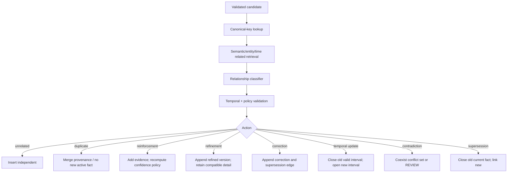

# Phase 3 Design Options and Research Decisions

调研日期：2026-09-20  
状态：Phase 3 设计建议；除明确标注“已实现”的内容外，不代表代码已交付  
决策原则：**先建立可证伪 baseline，再增加最小必要复杂度**

## 1. Research summary

长期记忆不是“无限历史 + 向量搜索”。原始研究和公开 benchmark 指向四个相互独立的问题：

1. **有限上下文管理**：MemGPT/CoALA 说明外部 memory 是受控的存储、检索和行动空间，而不是把全部历史重新塞回 prompt。[S1][S2]
2. **形成与整理**：Generative Agents 的 observation/reflection/planning 和 A-MEM 的结构化 note/link/evolution 表明 consolidation 可以有价值，但也引入错误概括和历史改写风险，必须通过 provenance 和 ablation 约束。[S3][S4]
3. **动态真相**：Graphiti/Zep 把关系事实建模为带有效窗口和来源的时态边；这种概念适合本项目，但论文/厂商报告不能替代本仓库自己的实验。[S5][S6]
4. **分层评测**：LongMemEval 提供 evidence session/turn 标签，可把 retrieval 与 final QA 拆开；LoCoMo、BEAM、LongMemEval-V2 各自覆盖不同数据规模和能力，不能混成一个无注释总分。[S7][S8][S9][S10]

### Recommended decisions at a glance

| Problem | Phase 3 decision | What is deliberately deferred |
|---|---|---|
| Source of truth | 保留 event + rebuildable projection | 拆 CQRS/microservices |
| Formation | strict-schema LLM candidate extractor + deterministic validation + utility gate | LLM 直接写库；端到端自主 memory agent |
| Utility gate | 可解释特征 baseline，在标注集上校准阈值 | 无数据的“智能权重”；立即训练复杂模型 |
| Evolution | related-memory retrieval + deterministic rules + bounded classifier + REVIEW/coexist | LLM-only conflict resolution |
| Embedding | **BGE-M3 dense mode** 作为默认本地 production candidate；测试仍用 deterministic | 同时启用 sparse/ColBERT；绑定某厂商 SDK |
| Candidate retrieval | BM25 + dense + hard metadata/temporal；predicate 是独立可消融通道 | 默认 graph/multi-hop |
| Fusion | RRF 保留为 baseline，与 normalized weighted fusion 对照 | 直接上 learned ranker |
| Reranking | 首个发布版本默认无模型 reranker；之后实验 local cross-encoder | 默认 LLM reranker |
| Packing | temporal/current filter + canonical dedup + exact token budget + source diversity | 未验证的 LLM contextual compression |
| Main benchmark | LongMemEval-cleaned | 把 LongMemEval-V2 当作同类对话 benchmark |
| Auxiliary benchmark | internal deterministic formation/evolution/retrieval suite；LoCoMo 仅兼容性 smoke | 一开始跑 BEAM 10M |
| PostgreSQL ANN | 先 exact filtered search；HNSW/IVFFlat 由 10K/100K/1M 实测决定 | 默认全局 HNSW |
| Extra infrastructure | 不增加 | Kafka/Redis/Neo4j/Milvus/Elasticsearch/LangGraph |

---

## 2. Why long-term memory instead of full conversation context?

| Option | Advantage | Disadvantage / risk | Complexity | Decision |
|---|---|---|---:|---|
| Full history in context | 零抽取；证据完整；实现最简单 | token/latency/cost 随历史增长；旧事实和隐私内容持续暴露；无法可靠删除/治理；long-context 仍会丢失远处证据 | Low | 必须作为 baseline，不作为产品架构 |
| Rolling summary | 上下文固定；成本较低 | summary 会丢来源、时间和少数但关键的事实；后续错误会累积 | Low–M | 可作为 baseline/episode view，不是真相层 |
| Chunk/vector RAG | 通用、易接入 | 语义相似不等于当前有效/授权/正确；更新与冲突困难 | M | 保留为 dense baseline |
| Event + versioned memory projection | 可回放、可治理、可分层检索、能保存 valid time/provenance | formation/evolution 复杂；需要多层评测 | M–H | **保留当前方向** |

MemGPT 的虚拟上下文和 CoALA 的 modular memory/action space 支持“受控外部记忆”的方向；但它们不证明某个具体检索器或写入策略适合 D.I.V.E。[S1][S2]

---

## 3. Memory formation and extraction

### 3.1 Extraction architecture options

| Option | Advantage | Disadvantage | Complexity | Expected benefit | Risk | Choose / reject |
|---|---|---|---:|---|---|---|
| A. Heuristic/regex only | 确定性、便宜、可离线、易解释 | 语言覆盖和组合事实 recall 低；无法处理隐含/时态/不确定事实 | Low | 稳定 fallback | 高漏记、规则膨胀 | **保留为 fallback/test，不作为生产主路径** |
| B. One-shot LLM → memory row | recall 和语言覆盖较好 | schema 漂移、幻觉、无条件写入、错误难定位 | M | 快速原型 | false memory 和供应商漂移 | Reject |
| C. LLM candidate → strict validation → normalization → gate → commit | 责任分层；可拒绝/重放；每阶段可测 | 调用和实现更复杂 | M–H | 最符合质量与可解释性目标 | pipeline 阶段间语义漂移 | **Choose** |
| D. Fine-tuned extraction model | 高吞吐、稳定 schema、可本地 | 需要足够高质量标注和模型运维 | H | 数据成熟后可能降成本 | 过早训练会固化错误 taxonomy | P2 candidate |

### 3.2 Proposed candidate schema

不要让 provider 直接构造数据库 `Memory`。引入不可持久化的 `CandidateMemoryV1`：

```text
schema_version
memory_type
subject {kind, raw, normalized, entity_id?}
predicate {raw, canonical}
object {raw, normalized, datatype, unit?}
valid_time {from, to, precision, timezone, uncertainty}
evidence_state = FACT | OBSERVATION | INFERENCE
explicitness = EXPLICIT | IMPLICIT | INFERRED
confidence
importance_hint
durability_hint
sensitivity_labels[]
source_event_ids[]
evidence_spans[]
entities[]
relations[]
extractor {provider, model, prompt_version, schema_version}
```

Validation order should be deterministic:

1. JSON/schema and enum validation.
2. Required field and numeric bound validation.
3. Evidence-span/source-event closure.
4. Canonical predicate/value and unit normalization.
5. Temporal interval/precision/timezone validation.
6. Namespace-scoped entity linking.
7. Sensitivity/retention policy.
8. Related-memory retrieval and relationship classification.
9. Utility decision.
10. Transactional commit.

Malformed response, model timeout, policy abstention and legitimate empty extraction must be different result codes. Fallback use must be logged; it must not masquerade as model-backed success.

### 3.3 Evidence state policy

| Evidence | Commit policy | Retrieval/presentation policy |
|---|---|---|
| Explicit FACT | 可进入 active，仍需安全/范围/重复检查 | 可作为回答证据，带来源 |
| OBSERVATION | 需要计数窗口和独立来源 | 不得改写成用户偏好/事实 |
| INFERENCE | 默认较短 durability；高风险内容进入 REVIEW 或跳过 | 必须显式标注，不能与 FACT 同权 |
| Unsupported/generated detail | Reject | 记录 validation reason |

---

## 4. Write gate and memory utility

### 4.1 Options

| Option | Advantage | Disadvantage | Complexity | Risk | Decision |
|---|---|---|---:|---|---|
| Keyword rules | 便宜、透明 | recall/precision 受措辞控制 | Low | fixture 过拟合 | fallback only |
| Handcrafted weighted score | 可解释、能快速 ablate | 权重若无标注仍是拍脑袋 | M | 假精确 | 仅作为可校准 baseline |
| Small supervised classifier / logistic regression | 概率可校准；特征贡献可解释 | 需要标注和漂移监控 | M | 数据偏差 | **标注集足够后首选** |
| LLM utility judge | 处理复杂语义 | 成本/漂移/自洽偏差；解释不稳定 | M | 把模型意见当事实 | 只产生特征/建议，不做最终 authority |

### 4.2 Recommended baseline

先定义单调、可解释的特征，不先冻结权重：

```text
future_usefulness
durability
specificity
novelty
importance
source_confidence
redundancy
sensitivity_risk
temporal_relevance
explicit_remember_request
```

流程：

1. 双人标注 formation dev set，包含 WRITE / SKIP / REVIEW 和理由。
2. 明确定义每个特征的 0–1 rubric 与 monotonic direction。
3. 用简单 logistic regression 或 constrained linear score 拟合，而不是手填最终权重。
4. 按 memory type 和敏感级别画 precision-recall / calibration curve。
5. 阈值由错误成本选择：普通偏好允许 REVIEW；安全/身份类要求高 precision。
6. 固定 `gate_version`、feature vector、threshold、decision、reason codes 和 provider trace。

用户明确“记住”可提高 future usefulness/durability，但不能绕过 namespace、sensitivity、malformed evidence 或删除策略。

### 4.3 Acceptance logic

- WRITE：证据闭包通过，utility 高于 type-specific threshold，且无 blocking policy。
- REVIEW：冲突/敏感/不确定性处于人工或 stronger-model review 区间。
- SKIP：低 utility、冗余、短暂、无证据或策略拒绝。
- ERROR/DEFER：provider/embedding/store 故障；不能伪装成 SKIP。

---

## 5. Memory evolution and conflict resolution

### 5.1 Relationship classification options

| Option | Advantage | Disadvantage | Complexity | Expected benefit | Risk | Decision |
|---|---|---|---:|---|---|---|
| Canonical-key rules only | 确定、易审计 | 不能处理改写/细化/语义冲突 | Low | 强 precision baseline | 漏分类 | 必须保留在高置信路径 |
| Embedding similarity thresholds | 低成本发现近似项 | similarity 不等于逻辑关系 | Low–M | 扩大 related set recall | 错误 merge | 只做 candidate generation |
| LLM-only classification + mutation | 语义覆盖广 | 非确定、会改历史、难重放 | M | 开发快 | 灾难性错误 | Reject |
| Related retrieval + rules + structured classifier + policy | 可在语义覆盖、确定规则、REVIEW 间平衡 | 多阶段、需要 gold matrix | H | 最符合 evolution 目标 | 分类/动作耦合 | **Choose** |

### 5.2 Proposed resolution pipeline



Classifier output must be an enum plus `existing_memory_ids`, evidence, confidence and proposed action. Mutation is performed by deterministic domain policy, not by arbitrary model-generated SQL/patches.

### 5.3 Required semantics

| Relationship | Meaning | Default action |
|---|---|---|
| unrelated | 不共享同一 assertion identity | insert |
| duplicate | 相同 assertion、相同/兼容时间、无新独立证据 | merge source; avoid duplicate active row |
| reinforcement | 相同 assertion，新增独立证据 | add evidence; recompute evidence confidence |
| refinement | 新事实更具体但兼容 | link `REFINES`; decide canonical view without erasing original |
| correction | 用户明确指出旧记忆错误 | append corrected version; close/retract old with correction reason |
| temporal update | 世界状态在时间点发生改变 | old `valid_to = transition`; new `valid_from = transition` |
| contradiction | 证据对同一 valid interval 不兼容，真值未决 | conflict set / REVIEW; do not silently choose |
| supersession | 当前单值断言被较新有效断言取代 | close old interval; append link |

For “成都 → 搬到上海”, transition time should come from the move expression/occurred time. Observation time is used only when no better valid time exists, and that fallback must be recorded.

### 5.4 Temporal representation options

| Option | Advantage | Disadvantage | Decision |
|---|---|---|---|
| Timestamp only | 简单 | 无法表示持续区间/日期精度 | Reject as sole model |
| Half-open interval `[from, to)` | 边界清晰、适合 current/as-of | 模糊时间需要额外字段 | **Core representation** |
| Interval + precision/uncertainty | 保存“2025年”“大约三月”等语义 | 查询/比较更复杂 | **Add in Phase 3** |
| Full temporal logic/Allen algebra | 表达力强 | 当前用例和数据不足 | Defer |

Observed/transaction time and valid time must remain independent. Every resolution action should itself be an immutable transition record with resolver version and source evidence.

---

## 6. Retrieval candidate generation

### 6.1 Channel options

| Channel | Advantage | Disadvantage | Best use | Phase 3 decision |
|---|---|---|---|---|
| BM25 / FTS | 精确名称、代码、数字和稀有词强；便宜可解释 | 释义/跨语言弱；中文分词要验证 | lexical anchors | **Keep** |
| Dense semantic | 释义、跨语言、概念问题强 | 模型/域漂移；成本；近似但错误实体 | semantic recall | **Add real provider** |
| Metadata hard filter | namespace/status/type/time 精度高 | 依赖 formation 结构正确 | safety/correctness | **Mandatory before ranking** |
| Predicate lookup | 自然问法到结构属性可高精度 | ontology 覆盖有限 | current profile-like facts | Keep as ablation channel |
| Entity matching | 实体精确问题可解释 | 当前 linker 太弱 | entity-scoped facts | Improve only after gold set |
| Relation traversal | 关系/多跳可能有用 | fan-out、误连和删除复杂 | genuine relational questions | Experimental, default off |
| Graph database | 深邻域查询/图算法 | 运维、双写、隔离/删除面扩大 | proven graph bottleneck | Reject now |

BM25 仍应存在，因为 embedding 对专有名词、版本号、URL、代码符号和罕见短串并不稳定。Dense 也不能替代 valid-time/namespace/predicate filters。最合理的起点是 **hard filters + BM25 + dense**，其他通道逐项消融。

### 6.2 Candidate pool contract

每个通道返回统一的 `CandidateHit`，但保留原始语义：

```text
memory_id
channel
raw_score
rank
channel_config_version
matched_fields / matched_entities / path
latency_ms
```

每个通道必须有独立 `candidate_k`；fusion 不应先加载全 namespace 再排序。所有 hard filters 在候选进入融合前应用，并记录 exclusion reason。

---

## 7. Fusion options

| Method | Advantage | Disadvantage | Complexity | Expected benefit | Risk | Decision |
|---|---|---|---:|---|---|---|
| Raw weighted sum | 快、直观 | BM25/cosine/boolean 量纲不可比 | Low | 若分数已校准可用 | 某通道支配 | Reject for current raw signals |
| Normalized weighted fusion | 可表达通道价值 | min-max/z-score 对 query candidate distribution 敏感 | M | 可能优于等权 RRF | 校准漂移 | **Ablation challenger** |
| RRF | 不依赖原始量纲；对异构 rank 稳健；实现简单 | 忽略 score margin；默认等权；对候选深度敏感 | Low | 强 baseline | 将所有通道视为等可靠 | **Keep as baseline, not dogma** |
| Learned rank fusion | 可学习 query/type/channel interactions | 需要足量 relevance labels、漂移监控、在线特征一致性 | H | 数据成熟后上限高 | 过拟合和解释成本 | P2 only |

RRF 的原始工作显示它是强健的 rank aggregation 方法，[S11] pgvector 也把 RRF/cross-encoder列为 hybrid search 组合方式。[S12] 这支持把 RRF 作为 baseline，不支持跳过本项目 ablation。

Required comparison:

```text
RRF(k in {20, 60, 100})
vs normalized weighted fusion (weights calibrated on dev only)
vs best individual channel
```

测试集只用于一次最终比较；不能在 test 上调 `k`/weight。

---

## 8. Reranking options

| Option | Advantage | Disadvantage | Complexity / latency | Decision |
|---|---|---|---|---|
| No model reranker | 最快、稳定、便于测 candidate contribution | top ordering 上限有限 | Low | **Initial default** |
| Heuristic quality/temporal rerank | 可解释、便宜 | 不理解 query-memory 语义 | Low | Keep only as explicit features |
| Bi-encoder re-score | 可批量、缓存 document vectors | 与 dense channel信息高度重复 | M | Usually reject unless query expansion differs |
| Cross-encoder | pairwise relevance 较强；适合 top 20–100 | CPU/GPU latency、不可预计算 | M–H | First reranker experiment |
| LLM reranker | 能处理时间/冲突复杂规则 | 最高延迟/成本；非确定；prompt injection surface | H | Offline experiment only |

首个 cross-encoder 实验必须报告 `Full System` vs `Full + reranker` 的 Recall@K/MRR/nDCG、query-type slices、p50/p95/p99 和成本。若主要提升来自修正 formation/temporal metadata，应修上游而不是永久用昂贵 reranker遮掩。

---

## 9. Embedding model selection

### 9.1 Comparison

下表的 local model metadata 来自官方 model card/config；“CPU viable”表示能够运行，不表示达到交互延迟。延迟必须在目标硬件、实际中英文 memory 长度与批量下测量。

| Model/provider | Chinese / English / multilingual | Dim / max tokens | Retrieval evidence | Local/GPU/CPU | License & privacy | Cost / production complexity | Decision |
|---|---|---:|---|---|---|---|---|
| **BGE-M3** | 中英强；100+ languages | 1024 / 8192 | 原论文覆盖 multilingual、dense/sparse/multi-vector、long-doc；model card 提供 MIRACL/MLDR 路径 [S13][S14] | 本地；GPU 建议用于吞吐；CPU 可行但需测；公开权重约 2.1 GiB | MIT；可内网、不出域 | 无 API token 费；需要模型服务、batching、监控 | **Default production candidate, dense-only first** |
| BGE-large-zh-v1.5 | 中文专用；英文不是目标 | 1024 / 512 | C-MTEB 强；成熟简单 [S15] | 本地；约 1.2 GiB 权重 | MIT | 中文单语部署较简单 | Reject as default because D.I.V.E requires Chinese+English; keep benchmark challenger |
| multilingual-e5-large-instruct | 多语言，中英覆盖 | 1024 / ~512 | 1B multilingual pair training；公开 MTEB/C-MTEB evidence [S16][S17] | 本地；GPU 建议；CPU 相对可行；约 1.0 GiB | MIT | query instruction 必须一致版本化 | Strong challenger; context length较短 |
| jina-embeddings-v3 | 多语言，中英覆盖 | 1024 reducible to 32 / 8192 | 570M, task LoRA, Matryoshka；原论文报告 multilingual/long-context [S18] | 本地/API；GPU 推荐 | **CC-BY-NC-4.0 model card**；本地商业默认受限 | API 条款另查；custom code/task adapter 增复杂度 | Reject as commercial local default unless legal approves or API contract chosen |
| gte-multilingual-base | 多语言，中英覆盖 | 768 / 8192 | MTEB/C-MTEB metadata [S19] | 本地；较小，CPU candidate；约 0.57 GiB | Apache-2.0 | custom model code / `trust_remote_code` supply-chain review | Efficiency challenger |
| OpenAI `text-embedding-3-large` | API multilingual | up to 3072; API supports dimension reduction | managed API; no local inference | API only | proprietary service；文本出域，需 DPA/region/policy | usage-based、低运维；价格随官方页面变化 | Optional managed provider, not privacy-first default |

OpenAI official model/pricing pages returned HTTP 403 to this audit environment, so this document deliberately does **not** freeze an unverified current price. Any benchmark manifest using it must record the official quote URL, access date, requested dimensions and actual billed tokens.[S20][S21]

### 9.2 Decision

Use **BGE-M3 in dense mode** as the default production candidate because it combines:

- public evidence for Chinese/English/multilingual retrieval;
- 1024 dimensions, compatible with pgvector's ordinary `vector` ANN index limit;
- long input support for episodic/resource memories;
- MIT license and local privacy;
- one model family that leaves sparse/multi-vector experiments possible without forcing them now.

Do **not** enable BGE-M3 sparse or ColBERT output in the first implementation. They would duplicate BM25 and add index/fusion complexity before evidence. Dense BGE-M3 must first beat BM25 and multilingual-e5/gte challengers on the D.I.V.E dev set at acceptable p95/cost.

`DeterministicEmbeddingProvider` remains the default in unit tests and offline regression. Production configuration must fail readiness when no semantic provider is configured; it must not silently present deterministic fallback as semantic search.

### 9.3 Provider contract changes

Return metadata with the vector:

```text
EmbeddingResult {
  vector,
  provider,
  model,
  revision,
  dimensions,
  normalized,
  degraded,
  latency_ms,
  token_count?,
  cost?
}
```

Store an `embedding_generation` and use dual-write/backfill/cutover for model changes. Never mix dimensions/models in the same ANN index without an explicit partial/expression-index design.

### 9.4 pgvector dimension implication

pgvector's current documentation states HNSW/IVFFlat `vector` indexes support up to 2,000 dimensions; `halfvec` supports up to 4,000.[S12] BGE-M3/e5/gte fit ordinary vector. A 3,072-dimensional managed embedding requires one of:

- provider-side dimension reduction with measured quality;
- `halfvec(3072)` with measured precision/recall;
- another storage/index strategy.

The current unbounded `embedding vector` migration and absent ANN index do not resolve this automatically.

---

## 10. Context packing

| Option | Advantage | Disadvantage | Decision |
|---|---|---|---|
| Retrieval order + char budget | simplest | duplicates/outdated facts/token error | Replace |
| Deterministic canonical dedup + temporal grouping + exact tokenizer | high correctness, explainable | requires model tokenizer adapter | **P0/P1 baseline** |
| MMR / diversity selection | reduces redundant context | lambda needs tuning; can omit corroborating evidence | Experiment after baseline |
| Cluster + representative memories | compresses large result sets | cluster instability; provenance aggregation | P2 |
| LLM contextual compression | can remove irrelevant clauses | cost, hallucinated omission, injection surface | Defer |

Recommended order:

1. remove exact/canonical duplicates;
2. enforce current/as-of consistency;
3. group unresolved contradictions together;
4. score relevance, importance and confidence separately;
5. count tokens using the actual answer model tokenizer;
6. apply source/type diversity only when it does not break required multi-evidence recall;
7. measure answer-support-per-token and QA accuracy.

---

## 11. Benchmark selection

### 11.1 Dataset comparison

| Benchmark | What it measures / scale | Metrics/evidence | License | Retrieval vs QA | Fit / cost | Decision |
|---|---|---|---|---|---|---|
| LoCoMo | 10 conversations; avg ~300 turns/9K tokens; up to 35 sessions; QA, event summary, multimodal dialogue [S7] | QA categories and evidence dialog ids | GitHub API `NOASSERTION`; no clear repo license found | Evidence ids allow separation | low-cost, but small/synthetic and license must be resolved | Compatibility smoke after legal check |
| **LongMemEval-cleaned** | 500 questions; S ~115K tokens/~40 sessions; M ~500 sessions; user/assistant/preference/update/temporal/multi-session + 30 abstention [S8] | session and turn evidence labels; official retrieval scripts | MIT dataset metadata | **Yes** | best match to current conversational memory | **Primary benchmark** |
| BEAM | 100 conversations, 2,000 validated questions; 128K/500K/1M/10M; 10 abilities including contradiction/update/temporal [S9] | final LLM-judge QA; dataset contains probing metadata | code MIT; data CC BY-SA 4.0 | possible but official focus is end answer | broad but expensive; synthetic and judge-heavy | P2, start 128K subset only |
| LongMemEval-V2 | 451 questions; up to 500 multimodal web/enterprise trajectories and 115M tokens; five experience/workflow abilities [S10] | answer accuracy, query latency, LAFS frontier | Apache-2.0 | backend returns compact evidence | agent trajectory/domain differs from current conversation memory; GPU/model-heavy | P2/P3, not primary |
| Internal D.I.V.E suite | formation, relationship, valid-time, deletion, leakage, retrieval slices | exact gold candidate/edge/evidence ids | owned | **Yes** | low cost; can expose exact domain failures | **Mandatory auxiliary** |

### 11.2 Why LongMemEval-cleaned is primary

- It directly covers knowledge update, temporal reasoning, preference and multi-session synthesis.
- Gold answer sessions and turn-level `has_answer` enable retrieval measurement independent of the answer model.
- 500 questions are large enough for slices but still practical.
- Cleaned release and data license are explicit.
- Official baseline retrieval supports BM25 and dense retrievers at turn/session granularity, making comparisons auditable.

Limitations must be reported: LongMemEval's conversations are compiled/simulated; evidence labels are session/turn rather than D.I.V.E normalized memories; the 30 abstention cases lack answer locations and should be evaluated separately rather than included in retrieval recall.

### 11.3 Internal suite design

Minimum relationship matrix:

```text
unrelated
duplicate
reinforcement
refinement
correction
temporal_update
contradiction
supersession
```

Cross each with Chinese/English, explicit/implicit, valid-time precision, one/multiple sources and malformed provider output. Add deletion and namespace leakage cases. Store gold source event ids, candidate fields, relationship edges, active view, historical view, expected retrieval ids and abstention flag.

---

## 12. Evaluation methodology

### 12.1 Formation

- candidate micro/macro precision, recall, F1 by memory type;
- unsupported-memory rate (must be zero for FACT release gate);
- duplicate write rate;
- WRITE/SKIP/REVIEW confusion matrix;
- calibration/Brier score for confidence/utility where probabilities are claimed;
- fallback and malformed-output rates.

### 12.2 Evolution

- relationship classification precision/recall/F1 per enum;
- state-transition exact match;
- valid interval boundary/precision accuracy;
- provenance coverage;
- current-view and historical-view correctness after the transition sequence.

### 12.3 Retrieval

- Recall@{1,5,10,20};
- Precision@{1,5,10};
- MRR;
- nDCG@10;
- all-required-evidence recall for multi-hop/multi-session;
- abstention precision/recall/F1;
- slices: factual, preference, temporal, correction/update, entity, multi-hop, negative, Chinese/English.

### 12.4 QA

- exact/F1 where deterministic;
- official dataset evaluator under a fixed reader/judge;
- temporal correctness;
- unsupported answer/hallucination;
- abstention;
- citation/provenance correctness.

### 12.5 System

- ingest/retrieve separately: p50/p95/p99, throughput and error rate;
- RSS/VRAM, DB/table/index size and index build time;
- embedding/extraction/reranker calls, tokens and cost;
- cold/warm cache distinction;
- exact vs ANN recall;
- per-namespace size distribution, not only total row count.

Every run stores a manifest: commit, dirty flag, dataset version/hash/license, seed, provider/model/revision, prompt/schema/gate/resolver versions, channel config, top-k, token budget, reader/judge, hardware/software, ANN settings, raw per-case rows and aggregate script version.

---

## 13. Ablation design

Required configurations:

| ID | Configuration | Purpose |
|---|---|---|
| A | BM25 only | lexical floor |
| B | Dense only | semantic contribution |
| C | BM25 + Dense | core hybrid value |
| D | C + Predicate | structured attribute value |
| E | D + Temporal hard filter | current/history correctness |
| F | E + Entity / Relation | structure contribution |
| G | F + Multi-hop | graph value and fan-out cost |
| H | Full deterministic rerank/packing | production candidate |
| I | H + cross-encoder | reranker cost/benefit |

Report at least:

| Configuration | Recall@5 | Precision@5 | MRR | nDCG@10 | Temporal Acc | Abstention F1 | p95 ms | Cost |
|---|---:|---:|---:|---:|---:|---:|---:|---:|

Preregister removal rules:

- Graph/multi-hop stays default-off unless it improves its target slice with confidence intervals and does not materially harm negative precision/latency.
- Reranker is rejected when improvement is within run variance or violates the latency budget.
- Dense is not called on query classes where it adds no measured recall and only adds cost.
- RRF is replaced if a simpler calibrated fusion is consistently better on held-out data.

---

## 14. PostgreSQL + pgvector options

### 14.1 Exact vs HNSW vs IVFFlat

| Option | Advantage | Disadvantage | Best condition | Decision |
|---|---|---|---|---|
| Exact filtered scan | perfect recall; no build/training; simple updates | latency grows with filtered candidate count | small per-namespace set, even if global table is large | **First production baseline** |
| HNSW | pgvector documents better speed–recall tradeoff than IVFFlat; no training; incremental | slower build, more memory, insert/update cost | read-heavy, changing data, measured need | Primary ANN candidate |
| IVFFlat | faster build, less memory | training/data-dependent lists; lower speed–recall tradeoff; poor when built too early | stable large batch-loaded corpus | Benchmark challenger, not default |

pgvector notes that ANN filtering occurs after index scan and can return too few rows; iterative scans, partial indexes or partitioning may be needed.[S12] It also explicitly warns that a shared multitenant ANN index lets tenants affect each other's recall and speed.

Therefore scale experiments must vary both:

- global rows: 10K / 100K / 1M;
- filtered rows per namespace: e.g. 100 / 1K / 10K / 100K;
- tenant selectivity/skew;
- exact, HNSW (`ef_search`) and IVFFlat (`lists`, `probes`);
- ingest/update/delete workload, not just static query latency.

Do not create one HNSW partition per tiny tenant by default. Start with B-tree namespace/status filters and exact vector scan on the filtered set. Use list partitioning or partial ANN only when measured tenant size/selectivity justifies it.

### 14.2 Required production schema changes

- real `(tenant_id, user_id, agent_id, project_id, scope)` ownership columns or a strongly typed scope id with FK;
- RLS/role policy defense in depth;
- fixed dimension per active embedding generation;
- vector row includes namespace/tenant for enforceable policy or joins covered by tests;
- model/revision/dimension/normalization/generation metadata;
- PostgreSQL-compatible Chinese lexical strategy proven against SQLite behavior;
- migration version table and rollback/forward policy;
- transition/audit table for lifecycle changes;
- indexes derived from measured query plans (`EXPLAIN ANALYZE`), not speculative DDL.

---

## 15. Observability options

| Option | Advantage | Disadvantage | Decision |
|---|---|---|---|
| Logs only | low setup | aggregation/debug difficult | insufficient alone |
| Structured event/trace records | replayable “why” data; deterministic tests | storage/privacy overhead | **Implement first** |
| OpenTelemetry traces/metrics | standard distributed observability | new dependency/collector ops | add with production adapter |
| Persist every prompt/response | powerful debugging | sensitive data/cost/retention risk | opt-in/redacted only |

Minimum write trace:

```text
request_id, event_id, namespace, extractor/model/prompt/schema,
candidate_count, validation outcomes, utility features/threshold,
related_memory_ids, relationship/action, committed_memory_ids,
latency/cost, fallback/degraded status
```

Minimum retrieval trace:

```text
request_id, namespace, query hash or policy-approved text,
plan version, active channels/config, per-channel count/latency,
candidate raw score/rank, exclusions, fusion contribution,
rerank/packing decision, token budget, returned ids
```

Sensitive query/prompt payload should be redacted or separately retained; observability must not become a second ungoverned memory store.

---

## 16. Explicitly rejected or deferred technologies

| Technology | Why not now | Evidence gate for reconsideration |
|---|---|---|
| Kafka | Postgres outbox workload and failure mode not measured as insufficient | sustained throughput/retention/replay requirement beyond Postgres worker |
| Redis | no cache/queue bottleneck; adds deletion residue | measured repeated hot-read or coordination need with deletion protocol |
| Neo4j/Graph service | current graph is semantically weak, not storage-bound | graph ablation improves target slice and relation-table p95 is bottleneck |
| Milvus/Qdrant | no pgvector production result exists | pgvector fails documented recall/latency/ops threshold |
| Elasticsearch/OpenSearch | no PostgreSQL FTS experiment exists | analyzer/scale/feature gap proven by benchmark |
| LangGraph / multi-agent writer | orchestration is not current bottleneck | extraction/resolution task demonstrably requires it and is safer/easier to test |
| Learned fusion | no relevance training corpus | stable labeled set large enough for held-out training/evaluation |
| LLM reranker/compressor | cost and correctness unmeasured | cross-encoder/packing baseline fails target quality and experiment shows net benefit |

---

## 17. Sources

All sources below were treated as evidence for concepts or dataset/model facts, not as proof that D.I.V.E achieves the reported third-party results. Accessed 2026-09-20.

- [S1] MemGPT original paper: https://arxiv.org/abs/2310.08560
- [S2] CoALA original paper: https://arxiv.org/abs/2309.02427
- [S3] Generative Agents original paper: https://arxiv.org/abs/2304.03442
- [S4] A-MEM original paper: https://arxiv.org/abs/2502.12110
- [S5] Zep temporal KG paper: https://arxiv.org/abs/2501.13956
- [S6] Graphiti official repository: https://github.com/getzep/graphiti
- [S7] LoCoMo official repository and paper: https://github.com/snap-research/locomo and https://arxiv.org/abs/2402.17753
- [S8] LongMemEval official repository / cleaned dataset: https://github.com/xiaowu0162/LongMemEval and https://huggingface.co/datasets/xiaowu0162/longmemeval-cleaned
- [S9] BEAM official repository / dataset: https://github.com/mohammadtavakoli78/BEAM and https://huggingface.co/datasets/Mohammadta/BEAM
- [S10] LongMemEval-V2 official repository / dataset: https://github.com/xiaowu0162/LongMemEval-V2 and https://huggingface.co/datasets/xiaowu0162/longmemeval-v2
- [S11] Cormack, Clarke, Büttcher, “Reciprocal rank fusion outperforms Condorcet and individual rank learning methods,” SIGIR 2009: https://doi.org/10.1145/1571941.1572114
- [S12] pgvector official README (exact/ANN, HNSW, IVFFlat, filtering, multitenancy, hybrid): https://github.com/pgvector/pgvector
- [S13] BGE-M3 paper: https://arxiv.org/abs/2402.03216
- [S14] BGE-M3 model card/config: https://huggingface.co/BAAI/bge-m3
- [S15] BGE-large-zh-v1.5 model card: https://huggingface.co/BAAI/bge-large-zh-v1.5
- [S16] Multilingual E5 technical report: https://arxiv.org/abs/2402.05672
- [S17] multilingual-e5-large-instruct model card/config: https://huggingface.co/intfloat/multilingual-e5-large-instruct
- [S18] Jina Embeddings v3 paper/model card: https://arxiv.org/abs/2409.10173 and https://huggingface.co/jinaai/jina-embeddings-v3
- [S19] GTE multilingual base model card/config: https://huggingface.co/Alibaba-NLP/gte-multilingual-base
- [S20] Official OpenAI embeddings guide: https://platform.openai.com/docs/guides/embeddings
- [S21] Official OpenAI API pricing: https://openai.com/api/pricing/
- [S22] Mem0 benchmark harness (implementation reference, vendor scores not used as D.I.V.E evidence): https://github.com/mem0ai/memory-benchmarks

## 18. Decision status

These are architecture recommendations, not benchmark results. BGE-M3, LongMemEval, RRF and PostgreSQL exact/HNSW choices must appear in ADRs only after the first reproducible D.I.V.E experiment records the options, configuration and consequences. Until then, wording should be “selected production candidate” or “baseline,” never “proven best.”
