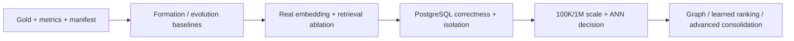

# Phase 3 Roadmap

日期：2026-09-20  
目标：从“本地架构正确”推进到“有可复现实验证据、可在 PostgreSQL 路径验证的 Agent Memory System”

## Implementation status (2026-09-20)

P0 的本地、离线控制面已经实现：versioned metrics/manifest、内部双语
evolution/retrieval fixtures、LongMemEval 防泄漏 adapter、严格候选 schema、
可审计 utility gate、八关系 resolver/immutable transitions、显式 degraded
embedding envelope、generation backfill/cutover/rollback、traceable channel config
和 A–H runner；P1 packing/config 的本地边界也已落地。默认离线 suite 为
165 passed、8 个 PostgreSQL opt-in tests skipped；启用 PostgreSQL 后为 173 passed。

这不等于 Phase 3 的 production definition 已完成：官方 LongMemEval、三模型
双语比较、真实 tokenizer packing、reader QA、RLS、100K/1M ANN 和 held-out
统计置信区间尚未在本环境执行。PostgreSQL adapter、8 项真实 integration tests
和 10K exact/synthetic-vector baseline 已完成，但不足以宣称 P1/P2 或 production
definition 完成；README 不作 production-ready 或模型最优声明。

## 1. Execution principles

1. **Evaluation precedes optimization.** 没有 gold、manifest 和 baseline 的功能不得宣称改善。
2. **Tests precede important mutations.** formation/evolution/deletion/tenancy 先写 gold case 和失败测试。
3. **One variable per ablation.** 不把 embedding、fusion、reranker、packing 一次全换掉。
4. **Offline CI remains deterministic.** 付费 API、GPU、公开数据集和 PostgreSQL 大压测是独立 profile。
5. **Production claims follow production evidence.** SQLite 10K 结果不能替代 PostgreSQL/pgvector 报告。
6. **Feature removal is a valid result.** graph/multi-hop/reranker 如果没有净收益，应默认关闭或删除。

### Priority meaning

- **P0**：在进一步扩展前必须完成；解决“质量是否真实、为什么写/取/变”的问题。
- **P1**：把通过 P0 的设计接入生产存储、安全和运维路径。
- **P2**：只有 P0/P1 数据证明需要时才做的规模或高级优化。

### Stage gates

未通过前一 gate，不以增加后续组件掩盖问题。

---

# P0 — Quality foundations and core memory behavior

## P0-1. Build a versioned evaluation core

**Objective**  
把当前 `run_cases()` 从 any-hit smoke helper 升级为分层评测核心，正确计算 formation、evolution、retrieval、QA 和 system metrics，并产生可复现 run manifest。

**Rationale**  
这是 Phase 3 的控制面。没有正确指标，RRF、embedding、graph 和 reranker 都无法被证伪。

**Files affected**

- evolve `src/dive_memory/evaluation.py`
- add `src/dive_memory/eval_metrics.py`
- add `src/dive_memory/eval_manifest.py`
- add `eval/configs/`, `eval/reports/README.md`
- add/expand `tests/test_evaluation.py`, `tests/fixtures/evaluation/`
- update `docs/07-evaluation.md`

**Dependencies**

- none; first Phase 3 task
- decide stable ids and relevance grades for gold evidence

**Acceptance criteria**

- Recall@K, Precision@K, MRR and nDCG@K formulas pass hand-computed fixtures including multiple required evidence items and ties.
- Formation/evolution confusion matrices and abstention precision/recall are reported independently.
- Every run writes commit, dirty flag, dataset hash/version/license, seed, model/provider/prompt/schema versions, retrieval config, token budget, machine/software and raw per-case rows.
- Existing offline smoke tests remain runnable without network or model downloads.
- “recall” no longer ambiguously means “at least one expected id appeared.”

**Tests**

- unit tests for every metric and zero/empty/tie edge case;
- regression test loading an old minimal `EvalCase` where backward compatibility is intentionally retained;
- manifest serialization/hash test;
- no paid API in default pytest.

**Benchmark**

- run current smoke suite through the new metrics;
- record it explicitly as `internal-smoke-v1`, including the three-case denominator;
- no system-quality claim yet.

**Risk**

- metric implementation can look plausible while being wrong; use hand-calculated fixtures and a second implementation/reference where possible.

---

## P0-2. Create the D.I.V.E deterministic gold suite and LongMemEval adapter

**Objective**  
建立一个内部可审计的 formation/evolution/retrieval regression suite，并接入 LongMemEval-cleaned 作为主公开 benchmark。

**Rationale**  
LongMemEval 覆盖 knowledge update、temporal、preference、multi-session 和 abstention，并有 session/turn evidence 标签；内部 suite 才能精确测 candidate schema、关系分类、删除和 namespace 安全。

**Files affected**

- add `eval/datasets/internal_v1/`
- add `eval/adapters/longmemeval.py`
- add `eval/runners/retrieval.py`, `eval/runners/qa.py`
- add `tests/fixtures/formation/`, `tests/fixtures/evolution/`, `tests/fixtures/retrieval/`
- add `tests/test_eval_adapters.py`
- add `docs/benchmark/longmemeval-methodology.md`

**Dependencies**

- P0-1 metrics/manifest
- confirm and record dataset license/version/hash
- fixed mapping from turn/session evidence to ingested event/memory ids

**Acceptance criteria**

- internal suite covers all eight relationships: unrelated, duplicate, reinforcement, refinement, correction, temporal update, contradiction, supersession.
- each relationship includes Chinese and English, explicit/implicit evidence, temporal boundary and negative cases.
- deletion, cross-namespace, malformed output, timeout and embedding failure fixtures are present.
- LongMemEval retrieval and QA stages can run separately; the writer never sees future question/evidence labels.
- 30 LongMemEval abstention items are scored for abstention but excluded from evidence recall exactly as documented by the official benchmark.
- dataset artifacts are not committed when license/size policy forbids it; downloader verifies checksum.

**Tests**

- adapter schema/ordering/leakage tests on a tiny checked-in synthetic sample;
- gold referential-integrity test: every expected source/memory/edge id exists;
- online-cutoff test prevents ingestion of future sessions;
- deterministic reader stub for CI.

**Benchmark**

- publish BM25-only and current-system results on a fixed LongMemEval dev subset before changing retrieval;
- publish complete main result only after configs are frozen;
- LoCoMo remains optional until repository/data licensing is resolved.

**Risk**

- ingestion can leak the question or `has_answer` labels; adapter tests and a “system-visible fields” allow-list are mandatory.

---

## P0-3. Introduce strict candidate extraction and a calibrated write gate

**Objective**  
实现 `CandidateMemoryV1`、严格验证/normalization、显式 fallback outcome 和可解释 utility decision；不让 LLM 直接构造持久化对象。

**Rationale**  
当前 regex/keyword pipeline 是最大的 memory-quality 瓶颈，真实 LLM adapter 也是最低覆盖模块。写错的记忆会污染所有下游检索实验。

**Files affected**

- add `src/dive_memory/candidate.py`
- evolve `src/dive_memory/llm.py`, `extraction.py`, `gate.py`, `models.py`
- add `src/dive_memory/normalization.py`, `sensitivity.py`
- evolve `store.py` / migrations for candidate decisions and version metadata
- add `tests/test_candidate_schema.py`, `tests/test_extraction_provider.py`, `tests/test_write_gate.py`
- add `docs/adr/ADR-007-candidate-extraction-and-write-gate.md`

**Dependencies**

- P0-1/P0-2 formation gold and metrics
- provider must support strict structured output or an adapter that validates before returning

**Acceptance criteria**

- all provider output is schema-validated; invalid enum, NaN/out-of-range confidence, invalid interval, missing source and unsupported evidence are rejected with stable reason codes.
- compound utterances can produce multiple candidates without losing provenance spans.
- `EMPTY`, `POLICY_SKIP`, `MALFORMED`, `TIMEOUT`, `FALLBACK_USED` and `COMMITTED` are distinguishable.
- each decision persists feature vector, threshold/policy, rule/gate/schema/prompt/model versions and source event ids.
- no unsupported FACT is committed on the internal release set; inferred content is explicitly labeled.
- heuristic extractor remains deterministic fallback and unit-test provider.

**Tests**

- property/boundary tests for confidence, importance and intervals;
- malformed JSON/schema, timeout, provider error and empty response;
- multilingual compound facts;
- evidence-span closure;
- privacy/sensitivity rule tests;
- replay under pinned extractor version.

**Benchmark**

- formation precision/recall/F1 per type;
- write abstention accuracy and duplicate/unsupported rates;
- latency, token/API cost and fallback rate;
- compare heuristic-only vs strict LLM pipeline, holding gate policy fixed.

**Risk**

- a strict schema can improve validity while silently reducing recall. Report validation rejection distribution and preserve raw redacted provider output for controlled debugging.

---

## P0-4. Build the conflict/supersession resolution engine

**Objective**  
把“不同单值 predicate 直接 supersede”升级为 related retrieval → relationship classification → temporal/policy validation → immutable transition。

**Rationale**  
Memory evolution is a core product capability, not a retrieval afterthought. Incorrect merge/supersession silently changes the user's remembered identity/history.

**Files affected**

- add `src/dive_memory/resolution.py`
- add `src/dive_memory/transitions.py`
- evolve `relations.py`, `service.py`, `temporal.py`, `models.py`, `store.py`
- add migration for `memory_transitions` / typed relationship edges
- add `tests/test_resolution_matrix.py`, `tests/test_transition_replay.py`
- add `docs/adr/ADR-008-memory-conflict-resolution.md`

**Dependencies**

- P0-2 relationship gold
- P0-3 normalized subject/predicate/object/time

**Acceptance criteria**

- all eight relationship enums are represented and audited.
- classifier proposes; deterministic domain policy mutates.
- duplicate merges provenance, reinforcement adds independent evidence, contradiction can coexist/REVIEW, temporal update uses valid time, correction records explicit reason.
- every state change appends a transition record; creation snapshot is never the sole audit history.
- current view and historical as-of view are both correct after Chengdu → Shanghai, retrospective corrections and unresolved contradictions.
- ambiguous low-confidence classification does not silently supersede.

**Tests**

- table-driven matrix by relation, language, time overlap and evidence count;
- valid-time boundary/timezone/precision tests;
- transaction rollback and idempotent retry for partial transition failure;
- replay with pinned resolver version;
- hard purge removes/rewrites transition provenance according to retention policy.

**Benchmark**

- per-relation precision/recall/F1 and transition exact match;
- current-view accuracy, historical accuracy and interval accuracy;
- error analysis for false merge vs false coexistence—the former carries higher cost.

**Risk**

- semantic classification can mutate truth. Use high precision thresholds, REVIEW/coexist fallback and immutable transition evidence.

---

## P0-5. Add a real embedding provider and safe model lifecycle

**Objective**  
实现本地 BGE-M3 dense provider 作为 production candidate，保留 deterministic test provider，并建立 generation-aware reindex/backfill/cutover。

**Rationale**  
当前默认 hash vector 没有语义能力；但直接换模型会导致历史向量混用、停机式重建或隐式 fallback。

**Files affected**

- evolve `src/dive_memory/embeddings.py`
- add `src/dive_memory/embedding_service.py`
- add configuration in `src/dive_memory/config.py`
- evolve `models.py`, `store.py`, migrations for embedding generation/revision/status
- add `tests/test_embedding_lifecycle.py`
- add opt-in `tests/integration/test_bge_m3_provider.py`
- add `docs/adr/ADR-009-embedding-model-selection.md`

**Dependencies**

- P0-1/P0-2 retrieval metrics and semantic query slice
- target model artifact/revision/license checksum
- chosen local serving runtime; do not add it to core dependency set

**Acceptance criteria**

- unit tests remain offline/deterministic by default.
- production readiness fails when configured semantic provider is unavailable; fallback is explicitly `degraded` and never silently scored as semantic.
- provider returns model/revision/dimension/normalization/token/latency metadata.
- different generations never mix in one query/index; backfill is resumable and cutover is atomic/reversible.
- BGE-M3, multilingual-e5-large-instruct and gte-multilingual-base are compared on the same D.I.V.E dev set and hardware.
- selected hybrid system is not statistically worse than BM25 overall and has a positive held-out gain on the preregistered semantic/paraphrase slice within the declared p95 budget.

**Tests**

- dimension/revision mismatch, partial backfill, retry, rollback and cutover;
- provider timeout and explicitly degraded result;
- vector normalization and batch ordering;
- model change while events continue to ingest.

**Benchmark**

- Chinese, English and cross-language Recall@K/MRR/nDCG;
- batch size vs throughput/p50/p95/VRAM/RSS;
- index/storage size at 1024 dimensions;
- API provider comparison includes tokens/cost and data-egress classification.

**Risk**

- BGE-M3 may be too slow on CPU or may not beat a smaller model on short memory objects. The ADR remains provisional until the measured report is attached.

---

## P0-6. Make retrieval channels traceable and run the A–H ablation

**Objective**  
把 candidate generation/fusion 从一个 SQLite method 拆成可开关、可计数、可计时但不过度抽象的通道，并完成规定的 A–H ablation。

**Rationale**  
当前无法回答 dense、predicate、relation、multi-hop、temporal 或 RRF 分别贡献多少；multi-hop 的现有星型扩散尤其需要被证伪。

**Files affected**

- evolve `planner.py`, `store.py`, `service.py`, `models.py`
- add `src/dive_memory/retrieval_trace.py`
- optionally add small channel functions under `src/dive_memory/retrieval.py` rather than a framework hierarchy
- add `eval/runners/ablation.py`
- add `tests/test_retrieval_channels.py`, `tests/test_retrieval_trace.py`
- add `docs/adr/ADR-010-hybrid-retrieval-and-fusion.md`

**Dependencies**

- P0-1/P0-2 metrics/data
- P0-5 real dense provider for semantic runs
- P0-4 valid temporal/current view

**Acceptance criteria**

- BM25, dense, predicate, temporal, entity, relation and multi-hop can be toggled independently through versioned config.
- each channel has independent candidate depth and returns raw score/rank/match/path/latency.
- exclusions record namespace/status/time/deletion/model-generation reason without exposing cross-tenant ids.
- RRF constant and optional channel weights are configuration, not magic literals.
- A–H report contains Recall@5, Precision@5, MRR, nDCG@10, temporal accuracy, abstention F1, p50/p95/p99 and cost by query slice.
- multi-hop remains default-off unless its target-slice confidence interval shows positive gain and negative precision/latency remain inside preregistered budgets.

**Tests**

- per-channel unit fixtures;
- no channel bypasses namespace/deletion/time hard filters;
- stable RRF/normalized-fusion tie handling;
- trace correctness and sensitive-query redaction;
- planner intent actually changes executed channels.

**Benchmark**

- A BM25; B Dense; C BM25+Dense; D +Predicate; E +Temporal; F +Entity/Relation; G +Multi-hop; H Full.
- additionally compare RRF `k={20,60,100}` to normalized weighted fusion tuned on dev only.
- report raw per-query rows and paired bootstrap confidence intervals.

**Risk**

- a refactor can change retrieval behavior before the experiment. First capture current-system golden outputs, then introduce channel seams behind compatibility mode.

---

# P1 — Production correctness, packing and operations

## P1-1. Upgrade context packing; evaluate a cross-encoder only afterward

**Objective**  
实现 canonical dedup、temporal/current correctness、contradiction grouping、exact token counting 和 source diversity；随后决定 cross-encoder 是否值得。

**Rationale**  
直接塞 retrieval 顺序会浪费 token，也可能把旧事实与当前事实无标注地混在一起。Packing correctness should precede reranking complexity.

**Files affected**

- evolve `context.py`, `models.py`, `service.py`
- add tokenizer adapter to `src/dive_memory/token_budget.py`
- add optional `src/dive_memory/rerank.py`
- add `tests/test_context_packing.py`, opt-in reranker integration tests
- add `docs/adr/ADR-011-context-packing-and-reranking.md`

**Dependencies**

- P0-4 transition semantics
- P0-6 channel trace/ablation

**Acceptance criteria**

- exact/canonical duplicates appear once; all retained source refs remain available.
- current query excludes or explicitly labels outdated facts; unresolved contradictions are grouped.
- token count uses the actual reader tokenizer and never exceeds budget.
- packing logs inclusion/exclusion reasons.
- cross-encoder becomes default only if held-out QA/retrieval gain exceeds run variance and p95/cost budget.

**Tests**

- Chinese/English token budgets;
- duplicate, superseded, conflicting and multi-evidence packing;
- deterministic tie/order;
- tokenizer unavailable/degraded behavior.

**Benchmark**

- answer-support-per-token, required-evidence coverage and final QA accuracy;
- H vs H+cross-encoder, p50/p95/p99 and GPU/CPU cost.

**Risk**

- diversity can remove corroborating evidence. Multi-evidence recall is a hard guardrail.

---

## P1-2. Implement the PostgreSQL/pgvector repository path

**Objective**  
实现与 SQLite domain contract 等价的 PostgreSQL adapter，并在真实 PostgreSQL + pgvector 上验证 migration、transaction、outbox、isolation、delete 和 vector queries。

**Rationale**  
Reference SQL is not a production backend. Production correctness must be proven before scale optimization.

**Files affected**

- add a narrow store protocol in `src/dive_memory/store_contract.py`
- keep `store.py` as SQLite adapter or rename only with backward-compatible import
- add `src/dive_memory/postgres_store.py`
- version/refine `migrations/`
- add `tests/contract/test_store_contract.py`
- add `tests/integration/postgres/`
- add `ops/postgres/README.md`, compose/test bootstrap if project policy allows
- add `docs/adr/ADR-012-postgresql-pgvector.md`

**Dependencies**

- stable P0 schemas, transitions and embedding generation
- ephemeral PostgreSQL 16+pgvector test environment

**Acceptance criteria**

- the same store contract suite passes SQLite and PostgreSQL where semantics should match.
- migration is executed from empty and previous supported version; rollback/forward policy is documented.
- two or more workers prove `SKIP LOCKED` no-double-claim, stale recovery, retry/dead-letter and transactional projection.
- namespace/tenant isolation and idempotency hold under concurrent connections.
- soft delete and hard purge leave zero active/vector/FTS/relation/provenance/outbox residue according to policy.
- exact vector query and Chinese lexical behavior are measured; no claim of SQLite equivalence without evidence.

**Tests**

- integration, concurrency, transaction rollback, fault injection, connection loss, migration and restore;
- EXPLAIN plan assertions limited to invariant properties, not brittle full-plan text;
- cleanup test verifies isolated test tenants.

**Benchmark**

- initial 10K exact filtered baseline: ingest throughput, retrieval p50/p95/p99, storage/index size and RSS;
- compare against SQLite only as separate labeled environments, not a speed contest.

**Risk**  

- premature “generic repository” abstraction can obscure SQL capabilities. Define only methods required by the current domain and allow adapter-specific optimized queries.

**Implemented evidence (2026-09-20)**

- `PostgresStore`, a narrow store protocol and migrations 001–007 execute against PostgreSQL 16.15 + pgvector 0.8.6.
- Eight opt-in integration tests pass: clean/idempotent migration, disjoint `SKIP LOCKED` claims, stale/max-attempt recovery, temporal transition + hard purge, namespace/provenance isolation, exact cosine, transaction rollback and concurrent idempotency.
- The isolated 10K dense-only exact run measured 38.62 memories/s ingest and 167.18/176.78/179.36 ms retrieval p50/p95/p99. See `docs/benchmark/postgres-exact-10k-report.md` and ADR-012.
- Remaining P1-2 evidence: connection-loss/restore fault injection, production pooling, broader shared contract coverage, Chinese FTS analysis, hybrid-path scale and concurrent load. RLS belongs to P1-3.

---

## P1-3. Enforce tenant isolation, privacy and deletion semantics

**Objective**  
把 opaque optional namespace auth 升级为明确 scope ownership、action authorization、RLS defense-in-depth、sensitivity/retention policy and end-to-end purge verification.

**Rationale**  
Long-term memory stores high-risk personal context. Application filters alone are insufficient for a production claim.

**Files affected**

- evolve `auth.py`, `api.py`, `models.py`, `sensitivity.py`, `store_contract.py`
- migrations for tenant/scope ownership and RLS
- add `tests/security/`, `tests/integration/postgres/test_rls.py`, `test_hard_purge.py`
- add `docs/security-threat-model.md`, `docs/deletion-semantics.md`

**Dependencies**

- P1-2 PostgreSQL path
- organizational IAM/KMS/retention decisions

**Acceptance criteria**

- tenant/user/agent/project/scope ownership is explicit and validated.
- actions are authorized, not only namespaces; auth cannot be accidentally disabled in production config.
- RLS/integration tests show cross-tenant reads/writes/updates/deletes fail even when application SQL is wrong.
- sensitive labels control storage/provider egress/retention.
- recoverable delete vs hard erasure is explicit in API and docs.
- hard purge test covers DB projections, vectors, FTS, transitions, provenance, outbox, cache/object store/backups where present.

**Tests**

- cross-tenant matrix across every endpoint/action;
- confused-deputy and idempotency-key leakage;
- stale index/residue checks;
- retention expiry and legal-hold conflict behavior where applicable.

**Benchmark**

- RLS/partition/filter overhead on representative tenant skew;
- purge duration and residue counts.

**Risk**

- encryption and deletion can become false assurance if backups/exports are excluded. Document system boundary and recovery retention precisely.

---

## P1-4. Add production observability, centralized configuration and CI quality gates

**Objective**  
让系统能回答“为什么写入/跳过”和“为什么召回/排除”，同时固定配置、静态质量和 deterministic CI。

**Rationale**  
Phase 3 experiments require consistent trace data; production incidents require request/event/memory correlation without creating a second privacy leak.

**Files affected**

- add/evolve `config.py`, `tracing.py`, `retrieval_trace.py`
- evolve `api.py`, `service.py`, provider adapters and workers
- add CI workflow, lint/type/coverage configuration
- update README, architecture, known limitations and runbooks
- add ADR index and ADR validation test

**Dependencies**

- P0 trace schemas
- P1 production runtime choices

**Acceptance criteria**

- request/event/memory/job ids correlate write and read pipelines.
- per-stage latency/count/error/fallback metrics exist.
- sensitive payload logging is opt-in, redacted and retention-controlled.
- central config is validated and version/hash is stored in benchmark manifests.
- CI runs offline unit/regression tests, static checks and a defined branch/line coverage gate; model/PG suites are separate explicit jobs.
- README/ADR/benchmark claims are checked against generated run manifests where feasible.

**Tests**

- trace field and redaction tests;
- config invalid/missing production provider/auth tests;
- logging failure must not break core transactions;
- CI smoke from clean environment.

**Benchmark**

- tracing on/off overhead and log volume;
- cardinality/storage impact.

**Risk**

- high-cardinality ids and raw prompts can be expensive and sensitive. Use bounded labels and policy-controlled payload storage.

---

## P1-5. Publish the first reproducible benchmark report and ADR set

**Objective**  
发布 formation/evolution/retrieval/QA/system 分层报告，并把实际选择写入 ADR，而不是把计划写成既成事实。

**Rationale**  
答辩和 Code Review 需要可重跑 artifact、失败案例和被否决方案。

**Files affected**

- add `docs/benchmark/phase-3-baseline-report.md`
- add run manifests/raw-result pointers under `eval/reports/`
- finalize ADR-007..012 or renumber consistently with existing ADRs
- update `README.md`, `docs/03-architecture.md`, `docs/06-retrieval-design.md`, `docs/07-evaluation.md`, `docs/08-technology-selection.md`

**Dependencies**

- P0 tasks and P1-1/P1-2 evidence

**Acceptance criteria**

- every headline number maps to a committed manifest and raw per-case result or reproducible external artifact.
- report distinguishes SQLite/PostgreSQL, exact/ANN, local/API models, dev/test sets and retrieval/QA.
- negative or null results are reported, including removed/default-off modules.
- known limitations include dataset synthetic bias, judge dependence, hardware, sample size and confidence intervals.

**Tests**

- report-link/config/schema validation;
- command smoke for documented reproduction steps.

**Benchmark**

- LongMemEval-cleaned main result;
- internal formation/evolution suite;
- A–H retrieval ablation;
- PostgreSQL 10K system baseline.

**Risk**

- benchmark tuning can overfit. Freeze test set/config before final run and preserve dev/test separation.

---

# P2 — Scale and evidence-gated optimization

## P2-1. Run 100K/1M pgvector exact–HNSW–IVFFlat experiments

**Objective**  
决定何时需要 ANN、选择 HNSW 还是 IVFFlat，以及 multitenant filtering/partitioning strategy。

**Rationale**  
pgvector 官方文档明确 HNSW/IVFFlat 有不同 build/memory/recall trade-off，且 ANN post-filtering 会影响低选择率 namespace 的结果。不能默认 HNSW。

**Files affected**

- add `benchmarks/postgres_vector/`
- add versioned ANN migrations only after result
- add `docs/benchmark/pgvector-scale-report.md`
- update ADR-012

**Dependencies**

- P1-2 correct PostgreSQL adapter
- representative data distribution and target hardware

**Acceptance criteria**

- 10K/100K and, if resources allow, 1M runs record exact recall reference, ANN recall@K, p50/p95/p99, ingest/update/delete throughput, build time, RSS and index size.
- vary global size, per-namespace size/selectivity and tenant skew.
- tune HNSW `ef_search` and IVFFlat `lists/probes` on dev only.
- choose exact search when filtered sets meet latency SLO; ANN only when it gives required gain within recall budget.

**Tests**

- index creation/migration and query correctness;
- filtered ANN returns enough results or explicitly degrades/falls back;
- deleted/updated vectors do not reappear.

**Benchmark**

- exact vs HNSW vs IVFFlat matrix under mixed read/write workload.

**Risk**

- synthetic uniform tenants hide post-filter failure. Include skew and high-churn namespaces.

---

## P2-2. Decide the fate of graph and multi-hop retrieval

**Objective**  
修正当前 star topology experiment, build genuine relational fixtures, and decide keep relational SQL traversal, redesign, or remove/default-off.

**Rationale**  
Current two-hop expansion reaches unrelated user facts. Adding Neo4j would make the wrong graph faster, not more correct.

**Files affected**

- possibly evolve `entities.py`, `relations.py`, retrieval channel
- add `eval/datasets/internal_v1/multihop*`
- add `docs/benchmark/graph-ablation.md`
- update ADR-003

**Dependencies**

- P0-4 normalized entities/relationships
- P0-6 ablation framework

**Acceptance criteria**

- gold cases require two or more meaningful edges, not traversal through a universal user hub.
- graph channel improves all-required-evidence recall on its slice with bounded negative precision and latency.
- if not, default-off/remove it and document the negative result.
- graph database is considered only if SQL traversal is then the measured bottleneck.

**Tests**

- cycle/fan-out/depth/path-provenance, deletion and namespace isolation;
- unrelated facts are not connected solely through user root.

**Benchmark**

- F vs G ablation; SQL relation traversal p95 and fan-out distribution.

**Risk**

- designing fixtures around the implementation can manufacture benefit. Gold questions must be authored before graph changes.

---

## P2-3. Evaluate learned fusion and advanced consolidation only if errors justify them

**Objective**  
在足量 labels 和 failure analysis 出现后，试验 learned fusion、semantic clustering/reflection or a trained utility classifier.

**Rationale**  
These methods may improve quality but are data-hungry and can hide upstream errors.

**Files affected**

- experimental code under `experiments/`, not the default domain path
- model cards/manifests under `eval/models/`
- new ADR only for promoted components

**Dependencies**

- stable labeled corpus from P0/P1 runs
- error analysis showing simpler fixes are insufficient

**Acceptance criteria**

- training/dev/test are user/session-disjoint.
- simpler RRF/utility/consolidation baselines remain in report.
- promoted model has calibration, drift, rollback, version and offline fallback plan.
- no mutation/consolidation is committed without provenance and false-memory gate.

**Tests**

- feature parity online/offline;
- model version rollback;
- adversarial/rare type cases;
- no test-data feature leakage.

**Benchmark**

- paired held-out comparison including cost/latency and confidence intervals.

**Risk**

- sparse labels and repeated users cause severe leakage/overfit.

---

## P2-4. Add broader benchmark coverage

**Objective**  
在主系统稳定后加入 BEAM 128K subset；解决 LoCoMo license 后加入 compatibility run；LongMemEval-V2 small 仅在 agent-trajectory/multimodal scope 成为产品目标时接入。

**Rationale**  
Broader benchmarks improve external validity but should not divert P0 effort from formation/evolution correctness.

**Files affected**

- `eval/adapters/beam.py`, optional `locomo.py`, future `longmemeval_v2.py`
- dataset-specific methodology/report docs

**Dependencies**

- P1 reproducible harness and budget approval
- dataset license and model/judge configuration

**Acceptance criteria**

- dataset-specific protocol is followed and versions/licenses are recorded.
- retrieval and final QA are separated wherever gold evidence permits.
- judge/model/top-k/token budget differences are never put on an unqualified shared leaderboard.

**Tests**

- tiny synthetic adapter fixtures and leakage guards;
- resume/checkpoint and cost cap.

**Benchmark**

- BEAM 128K first; expand only with a documented question and budget.
- LME-V2 small only for trajectory experience use cases.

**Risk**

- large LLM-judge benchmarks can optimize to the judge rather than user value; retain internal deterministic suite as release gate.

---

# 2. The five highest-value next investments

## 1. A real layered evaluation harness plus gold data

This is first because it turns every later architecture debate into a measurable question. It must distinguish formation, evolution, retrieval, QA and system performance. Without it, a higher README score can be caused by leakage, larger top-k, a stronger reader or a more lenient judge rather than better memory.

**Why before everything else:** embedding, RRF, graph and reranker have no defensible selection criterion without it.

## 2. Strict extraction and an evidence-backed write gate

Memory quality is bounded by what enters the store. A perfect retriever cannot repair omitted facts, hallucinated FACTs or untracked inference. Strict schema, evidence closure, normalization, visible fallback and calibrated WRITE/SKIP/REVIEW decisions address the root cause.

**Why before more retrieval:** garbage-in creates misleading retrieval experiments and long-lived privacy/correctness harm.

## 3. A real conflict/supersession engine with immutable transitions

Long-term memory differs from static RAG because user facts change. Correct duplicate/reinforcement/refinement/correction/temporal-update/contradiction behavior is the core differentiator and the main answer to “Chengdu → Shanghai.”

**Why before advanced consolidation:** current transition semantics are incomplete; summarizing or clustering them would amplify the ambiguity.

## 4. Real semantic embedding plus controlled retrieval ablation

BGE-M3 dense-only is the best current production candidate for bilingual local/privacy requirements, but it must compete against BM25 and smaller multilingual challengers on D.I.V.E data. Channel switches and traces must show the marginal value of dense, predicate, temporal, relation and multi-hop retrieval.

**Why not simply add a reranker:** candidate recall and channel value must be understood first; reranking cannot recover evidence that was never generated.

## 5. PostgreSQL production correctness, isolation and deletion verification

Once quality semantics stabilize, implement the real store adapter and prove transactions, `SKIP LOCKED`, RLS/tenant isolation, model generations and hard purge on PostgreSQL/pgvector. This converts a strong local MVP into a deployable system boundary.

**Why before Kafka/Neo4j/1M claims:** the current production path does not yet execute. Scaling an unverified adapter or adding infrastructure would multiply uncertainty.

## Why the other attractive tasks are not top five

- **Cross-encoder/LLM reranker:** valuable only after candidate recall and latency baselines exist.
- **MMR/clustering/compression:** packing correctness and exact token counting come first.
- **Graph database:** current graph benefit is unproven and topology is over-broad.
- **Learned rank fusion:** insufficient relevance labels today.
- **BEAM 10M / LongMemEval-V2:** high external validity but high cost and weaker fit to the immediate conversation-memory gap.
- **Kafka/Redis/vector DB split:** no measured bottleneck requires them.

---

# 3. Definition of Phase 3 complete

Phase 3 is complete only when all statements below are true:

1. A fixed internal suite and LongMemEval-cleaned run can be reproduced from manifests.
2. Formation, evolution, retrieval, QA and system metrics are reported separately.
3. Every committed memory and transition explains source, validator, gate and resolver versions.
4. Every retrieval explains executed channels, candidate ranks/scores, filters, fusion and packing decisions.
5. A real semantic provider is selected by bilingual quality/latency/privacy evidence; deterministic embedding remains test-only.
6. A–H ablation answers the contribution of dense, predicate, temporal, entity/relation and multi-hop modules.
7. Components with no measurable net benefit are default-off or removed.
8. PostgreSQL/pgvector integration tests prove transaction, worker concurrency, tenant isolation and hard purge.
9. Scale reports say exactly which backend, data size, tenant distribution, hardware, index and model were measured.
10. README, architecture docs, ADRs and benchmark reports describe only implemented and verified capability.
